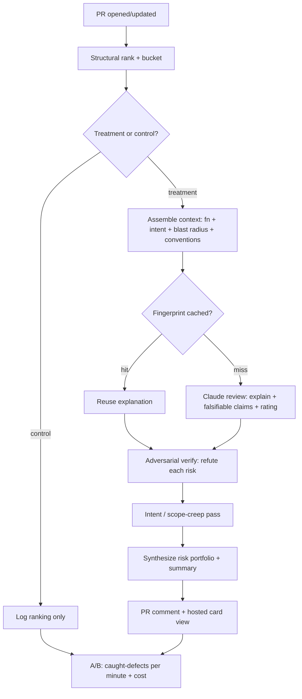

# diffsense Review Engine — Quality-First LLM Review

## Summary

A GitHub App that reviews a pull request and produces the highest-quality reviewer-facing output it can: it ranks every diff hunk by structural risk, gathers deep code context around the riskiest chunks, runs a Claude review pass that explains each change and makes falsifiable risk claims, adversarially verifies those claims to kill false positives, flags scope creep against the PR's stated intent, and synthesizes a PR-level risk portfolio. Output lands as an advisory comment in the PR thread plus a hosted review view. The goal is the best review a reviewer has ever gotten on a large AI-generated PR — fast where it can be, deep where it must be.

## Problem Frame

As AI generates more code, reviewing it is the bottleneck. Large AI PRs arrive in file order; reviewers fatigue and skim the tail where the risky change hides (defect detection drops 87%→28% as PRs grow; 61% of AI PRs get zero real review). Existing tools (CodeRabbit, Greptile, Copilot review) post inline comments or a summary, but none combine attention-directing risk ranking, deep-context explanations, adversarial false-positive control, and intent/scope-creep detection into one reviewer experience. The quality ceiling of AI review is set by context and verification — Greptile's full-codebase context yields an 82% bug-catch rate vs 58% for context-poor tools, and unverified findings train reviewers to ignore the tool. diffsense optimizes both.

## Key Decisions

- **Output quality is the objective; simplicity is not a constraint.** Every component is justified by whether it improves what the reviewer sees, not by build cost. Cost is controlled structurally (below), not by cutting quality.
- **Rank-then-explain is a quality architecture, not a cost compromise.** A cheap, deterministic structural sorter directs attention to the riskiest chunks first (reviewers trust a stable order; AUC 0.96 vs 0.52 for semantic ranking); the expensive LLM pass then goes deep only where it matters. This is the retrieve-then-rerank pattern — it makes the output both trustworthy and tractable on 4,000-line PRs, where putting an LLM on every chunk would be slower, costlier, and non-deterministic.
- **Context is the biggest quality lever.** The LLM reviews each risky chunk with the enclosing function/file, the PR's stated intent, the chunk's blast radius (call sites), and cached repo conventions — not the bare hunk.
- **Adversarial verification is mandatory.** Every flagged risk is challenged by an independent LLM pass that tries to refute it; refuted findings are dropped or downgraded. Precision is the trust currency.
- **Best models, tiered by stakes.** `claude-opus-4-8` is the default review model; `claude-fable-5` is used for the highest-risk chunks and the PR-level synthesis. Adaptive thinking on, structured outputs enforced.
- **Inference follows attention, plus a fingerprint cache.** Deep LLM passes run on the top-risk and reviewer-opened chunks; an AST/structural fingerprint cache reuses prior explanations for recurring chunks. Quality without runaway cost.
- **Advisory, in-GitHub, with a hosted deep view.** Findings post into the PR thread; the full per-chunk detail lives in a hosted review view. Nothing blocks merge.

## Actors

- A1. **Reviewer** — primary user; reads the comment and the hosted view, acts on flagged chunks, marks findings 👍/👎.
- A2. **PR Author** — opens/updates the PR; their stated intent (title/description) feeds the scope-creep pass.
- A3. **Eng-Manager** — buyer/sponsor; cares about the PR-level portfolio and the aggregate outcome metric.
- A4. **diffsense App** — runs the review pipeline and renders output.

## Requirements

**Structural ranking (attention director)**

- R1. For each opened/updated PR, the App ranks every diff hunk by a structural risk score (size log-scaled, risk-path membership, API-boundary crossing, test-delta proxy) and buckets High/Medium/Low by within-PR percentile, surfacing a non-empty "review first" set on every PR. No LLM in this stage.
- R2. Generated, binary, and lockfile hunks are demoted to Low before ranking; unrecognized languages fall back to size + risk-path signals and never error.

**Context assembly**

- R3. For each chunk entering the LLM stage, the App assembles a context bundle: the hunk, its enclosing function/file region, the PR's stated intent (title/description), the chunk's blast radius (call sites of changed symbols), and the repo's cached convention notes.
- R4. Repo convention notes are cached per repo and reused across PRs as a stable prompt prefix.

**LLM review pass**

- R5. The App runs a Claude review pass over the top-risk and reviewer-opened chunks (inference follows attention, not PR size), producing per chunk: a plain-language explanation of what the change does, a set of falsifiable claims each tied to evidence, and a risk rating with named reasons.
- R6. Review output is returned as a validated structured object (schema-enforced), not free prose, so every claim is individually addressable and refutable.
- R7. The review model is `claude-opus-4-8` by default and `claude-fable-5` for chunks in the top risk tier and for the PR-level synthesis.
- R8. An AST/structural fingerprint cache stores per-chunk explanations; a recurring chunk reuses its cached explanation instead of re-running inference.

**Adversarial verification**

- R9. Each flagged risk is challenged by an independent LLM pass prompted to refute it using the same context bundle; a refuted finding is dropped or downgraded, and the surviving findings carry a verification verdict.

**Intent and scope**

- R10. The App maps diff regions to the PR's declared intent and flags regions that match no declared intent as scope creep, surfaced as a distinct finding class.

**PR-level synthesis**

- R11. The App synthesizes a PR-level result: a named risk portfolio (e.g. "2 unverified API-boundary changes", "1 undeclared data-model edit"), an intent-coverage summary, and a senior-reviewer-style overview. Each portfolio position links to its chunks. There is no single opaque numeric score.

**Delivery**

- R12. The App posts exactly one advisory comment per PR, edited in place on new commits, leading with the portfolio and the ranked "review first" findings (deep-link + explanation excerpt + verification verdict per finding), with a link to the hosted review view; each finding invites a 👍/👎 reaction.
- R13. The hosted review view presents the full per-chunk detail — explanation, falsifiable claims with refute affordance, risk reasons, blast radius — in a card-based reviewer surface. Advisory only; never gates merge.

**Delivery mechanism and experiment**

- R14. The App is a GitHub App (fine-grained read-PR + write-comment permissions, genuine bot identity) reacting to `pull_request` webhooks.
- R15. Eligible PRs (excluding drafts, bot/dependency PRs, and sub-~20-line PRs) split into treatment and silent-control arms by stable hash of the PR number, so the same team produces both conditions.
- R16. The App tracks inference cost per PR and surfaces it against a per-PR budget; cost is a first-class kill-criterion input.

## Key Flows

- F1. **Review a PR**
  - **Trigger:** A2 opens/updates a PR; the App receives the webhook.
  - **Actors:** A4, A1
  - **Steps:** rank hunks (R1) → assign arm (R15) → for control, log only; for treatment, assemble context for top-risk chunks (R3) → review pass producing structured findings (R5–R7), reusing cache where possible (R8) → adversarial verification drops false positives (R9) → scope-creep pass (R10) → synthesize portfolio (R11) → post comment + hosted view link (R12, R13) → record cost (R16).
  - **Outcome:** A1 opens the PR to a verified, prioritized, explained set of findings and a PR-level portfolio.
  - **Covered by:** R1, R3, R5, R9, R10, R11, R12, R15

- F2. **Reviewer judges a finding**
  - **Trigger:** A1 reads a finding and judges it a real catch or noise.
  - **Actors:** A1, A4
  - **Steps:** A1 reacts 👍/👎 (R12) or refutes a specific claim in the hosted view (R13) → A4 logs it against the finding's verdict and the chunk fingerprint.
  - **Outcome:** Precision signal accrues and feeds the fingerprint cache's quality over time.
  - **Covered by:** R12, R13

## Acceptance Examples

- AE1. **Covers R9.** Given a chunk the review pass flags as a possible null-deref, when the adversarial pass shows the value is guarded upstream, then the finding is dropped (or downgraded) and does not appear as a High finding.
- AE2. **Covers R5, R8.** Given a chunk whose fingerprint matches one explained on a prior PR, when review runs, then the cached explanation is reused and no new inference is billed for that chunk.
- AE3. **Covers R10.** Given a PR whose description says "add rate limiting" but which also edits `auth/session.ts`, when the scope pass runs, then the auth edit is surfaced as a scope-creep finding distinct from the rate-limiting changes.
- AE4. **Covers R1, R5.** Given a 4,000-line PR, when review runs, then structural ranking orders all hunks deterministically and the LLM pass runs only on the top-risk and opened chunks — not all 4,000 lines.
- AE5. **Covers R11.** Given a set of per-chunk findings, when synthesis runs, then the PR-level output is a list of named, chunk-linked risk positions and an intent-coverage summary, not a single opaque number.

## Success Criteria

- SC1. **Primary.** On treatment PRs, caught-defects per review-minute is measurably above native GitHub order, sustained across weeks 3–8 in a majority of pilot teams.
- SC2. **Precision.** The 👍 rate on flagged findings stays high enough that reviewers keep engaging — false-positive flags (👎) do not dominate; the adversarial pass is the lever.
- SC3. **Retention.** Reviewers still act on diffsense output (reactions / hosted-view opens) by week 2 rather than drifting back to plain GitHub.
- SC4. **Unit economics.** Inference cost per PR stays under the per-PR budget across the PR-size distribution, including XL PRs.

**Kill / pivot criteria.** Stop or pivot if two or more hold after the pilot: (a) no measurable defect-per-minute advantage over native GitHub; (b) precision is too low and reviewers abandon by week 2; (c) cost per PR exceeds budget on large PRs (margin-unviable).

## Scope Boundaries

**Deferred for later**

- Reviewer-driven chunk splitting/merging (`git add -p`-style) and the boundary-learning model it trains.
- Personalized/learned risk weights per reviewer or team.
- Merge-gating once trust is earned (advisory only for now).

**Outside this product's identity**

- A manager-facing surveillance dashboard exposing individual reviewer behavior — findings and precision signals serve the reviewer as coaching.
- Shift-left interception into the code-generation agent loop — a different product.
- A single opaque global score — replaced by the named portfolio by design.

## Dependencies / Assumptions

- D1. Assumes GitHub App access to PR diffs, file contents, and timelines is sufficient to assemble context bundles (enclosing functions, call sites) and derive the A/B metric without client instrumentation.
- D2. Assumes blast-radius (call-site) discovery is tractable from the repo via structural/AST search within a bounded read budget per chunk.
- D3. Assumes the fingerprint cache yields meaningful hit rates on AI-generated PRs (repeated boilerplate/patterns) — the cost model depends on it.
- D4. Assumes adaptive-thinking review at the chosen effort keeps per-PR cost under budget when inference is restricted to top-risk + opened chunks.

## Outstanding Questions

**Resolve before planning**

- Q1. The per-PR inference budget figure (the number SC4 and kill-criterion (c) are measured against) — set it before building cost telemetry.

**Deferred to planning**

- Q2. Concrete structural weights and risk-path lists (R1); the exact context-bundle size per chunk (R3); the chunk-tier threshold that routes to `claude-fable-5` (R7).
- Q3. Review and adversarial prompt/schema design (R5, R6, R9); the fingerprint algorithm (R8); the GitHub timeline events for the A/B metric (R15).
- Q4. Hosted-view hosting and auth (R13).

## Sources / Research

- arXiv 2601.00753 — structural signals predict review effort at AUC 0.96 at PR creation; semantic/CodeBERT only 0.52 (basis for structural ranking as the sorter).
- arXiv 2605.02273 — 61% of AI-generated PRs receive zero recorded review activity.
- Propel Code — defect detection 87% (<100 lines) → 28% (1,000+); XL PRs get 1.8 comments in 4.2 hours.
- Greptile — full-codebase context yields 82% bug-catch vs 58% for context-poor tools (basis for context assembly).
- Snyk / Apiiro — opaque scores cause disengagement; show factor breakdown (basis for the portfolio over a single score).
- Claude API — `claude-opus-4-8` (default review model) and `claude-fable-5` (top-risk chunks + synthesis); structured outputs via `output_config.format`; adaptive thinking; prompt caching for the repo-convention prefix.
- Strategy anchor: `STRATEGY.md`. Ideation: `docs/ideation/2026-06-18-diffsense-pr-review-ideation.html`.
