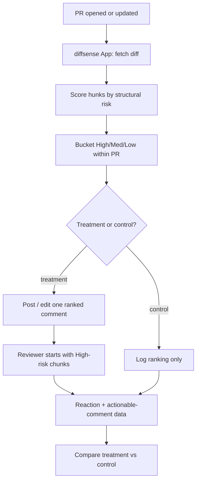

# Risk-Prioritized PR Review — 8-Week Validation MVP

## Summary

A GitHub App that ranks every diff hunk in a pull request by structural risk at PR-open time and posts one advisory comment into the PR thread: "review these N chunks first," each with a one-line reason. No UI, no AI explanations, no chunk-splitting, no score gate. Its only job is to prove one thesis cheaply: reviewers guided by risk-ordering catch more real defects per review-minute than reviewing the same PR in native GitHub order.

## Problem Frame

As AI generates more code, the bottleneck moves from writing to reviewing. On high-AI teams PR size is up 154% and review time up 91%, yet delivery metrics stay flat — review eats the gain. Defect detection collapses with size (87% caught under 100 lines, 28% over 1,000), because reviewers read a large diff in file order, hit fatigue, and skim the tail — where the risky change often sits. 61% of AI-generated PRs get zero recorded review activity at all.

The expensive product the larger `diffsense` vision implies (card UI, per-chunk AI explanations, scoring, chunk memory) is unjustified until one prior question is answered: does merely *re-ordering reviewer attention toward the riskiest changes* measurably improve review outcomes? This MVP isolates that question and nothing else. If bare risk-ordering wins, everything downstream is amplification; if it doesn't, no UI would have rescued it.

## Key Decisions

- **Validate before building the product.** This is an experiment, not v1 of the product. Every scope choice optimizes for cheap, honest measurement of one metric — not for a shippable feature set.
- **Structural signals only — no LLM in the loop.** Ranking uses signals available from the diff and repo metadata (size, risk-path, API-boundary, test-delta). This keeps inference cost at near-zero, makes the MVP language-agnostic, and tests the cheapest possible version of the thesis. Structural signals predict review effort at AUC 0.96 at PR-open; semantic models reach only 0.52 — so the cheap signal is also the strong one.
- **A chunk is a unified-diff hunk, not an AST unit.** V1 does not attempt semantic decomposition. A "chunk" is a contiguous diff hunk, grouped per file. Semantic chunking and reviewer-driven splitting are explicitly out of scope (they are the *next* bet, not this one).
- **Advisory, parasitic, in-GitHub.** Output is one comment in the PR thread. Nothing blocks merge; the reviewer never leaves GitHub. Trust is earned before any authority is claimed, avoiding the enforcement backlash that opaque-score gates provoke.
- **Buyer is the Eng-Manager; champion is the Reviewer.** "Tinder/swipe" is not a pitch word and not in this build. Anti-rubber-stamp signals belong to the reviewer (coaching), never to a manager surveillance dashboard, or the champion turns hostile.
- **Pilot the population with the most acute pain.** Recruit ~10 teams already shipping AI-generated code at volume (5–50 engineers, frequent large PRs), where the effect size — and thus the signal — is largest.
- **Measure relatively, from GitHub-native events.** Review-minutes derive from the span between a reviewer's first PR interaction and their submitted review; the actionable-comment link is a fuzzy line-overlap between a review comment's anchor and a later commit's diff. Absolute values are noisy, but both arms share the same noise, so the treatment-vs-control comparison holds. Exact event selection is tuned in week 1 against the seeded-defect calibration.
- **Randomize at the PR level.** PRs are assigned to treatment/control by a stable hash of the PR number (deterministic 50/50), not per-team or per-reviewer, keeping the arms balanced within each team. Accepted limitation: a reviewer sees both arms over an 8-week pilot (a learning effect), mitigated by reading the within-PR relative metric rather than absolute reviewer speed.

## Actors

- A1. **Reviewer** — the engineer assigned to review the PR. Primary user and champion. Reads the comment, decides where to look first, leaves review feedback in GitHub as usual.
- A2. **PR Author** — opens/updates the PR. Sees the comment but takes no required action in this MVP.
- A3. **Eng-Manager** — the buyer/sponsor who installs the App for the pilot team and cares about the aggregate outcome metric.
- A4. **diffsense App** — the GitHub App that receives webhooks, computes the ranking, and posts/updates the comment.

## Requirements

**Ranking engine**

- R1. For each opened or updated PR, the App ranks every diff hunk by a structural risk score computed from: change size (added + deleted lines, log-scaled), risk-path membership (file path matches a high-risk class — auth, payment, migration, config, infra, security, deploy), API-boundary crossing (changed lines alter exported/public symbols or signatures), and a test-delta proxy (whether the PR also changes a corresponding test file).
- R2. Initial signal weights are hand-set and transparent — not learned. No historical data exists at pilot start; weights are a documented starting heuristic to be tuned during the pilot, not a trained model.
- R3. Chunks are bucketed into risk tiers (High / Medium / Low) by percentile *within the PR*, so every PR — large or small — surfaces a non-empty "review first" set rather than depending on an absolute threshold.
- R4. Generated, binary, and lockfile changes are demoted to Low by path/extension heuristic before ranking.

**PR-thread output**

- R5. The App posts exactly one comment per PR and edits it in place on subsequent commits — it never posts a second comment or generates per-commit notification spam.
- R6. The comment leads with a one-line header ("diffsense ranked N chunks — review these M first") and an ordered list of the High/Medium chunks, each carrying a deep-link to the exact hunk in the Files-changed view, a one-line risk reason, and its tier. The Low remainder collapses to a single summary line.
- R7. The comment's tone is advisory and never instructs the reviewer to block, approve, or change the merge decision.
- R8. Each listed chunk invites a one-click reaction (👍 = real catch / 👎 = noise) that serves as the reviewer feedback micro-signal without any separate instrumentation.

**Delivery and robustness**

- R9. The App is delivered as a GitHub App (org/repo install, fine-grained read-PR + write-comment permissions, genuine bot identity) — not a CI Action and not a human bot-account.
- R10. Ranking degrades gracefully on unrecognized languages: path and symbol heuristics that don't match contribute zero, the score falls back to size + risk-path signals, and the App always produces an ordering rather than erroring.

**Pilot measurement**

- R11. Within each pilot team, eligible PRs — excluding drafts, bot/dependency PRs, and PRs under ~20 changed lines — are split into a treatment arm (comment posted) and a silent control arm (ranking computed and logged, no comment posted) by a stable hash of the PR number, so the same team produces both conditions.
- R12. The primary outcome is actionable-comments per review-minute, derived from GitHub-native data: a review comment counts as "actionable" when a later commit in the same PR changes the lines it referenced; review-minutes are derived from PR-timeline timestamps.
- R13. A one-time seeded-defect calibration run in week 1 checks that the actionable-comment proxy tracks real defect detection before the proxy is trusted for the headline result.
- R14. Post-merge reverts and hotfixes traceable to a reviewed PR are tracked as a lagging secondary signal, reported but not gating the primary result.

## Key Flows

- F1. **Rank and post on PR open**
  - **Trigger:** A2 opens a PR; the App receives the `pull_request` webhook.
  - **Actors:** A4, A1
  - **Steps:** A4 fetches the diff and changed-file metadata → computes per-hunk scores (R1) → buckets within the PR (R3) → if the PR is in the treatment arm, posts the ranked comment (R5, R6); if control, logs the ranking only (R11).
  - **Outcome:** A1 opens the PR and sees (treatment) a prioritized starting point, or (control) the unmodified native view.
  - **Covered by:** R1, R3, R5, R6, R11

- F2. **Update in place on new commits**
  - **Trigger:** A2 pushes more commits; the App receives `synchronize`.
  - **Actors:** A4
  - **Steps:** A4 re-ranks the current diff → edits the existing comment in place (R5).
  - **Outcome:** The comment reflects the latest diff without a new notification.
  - **Covered by:** R5

- F3. **Capture the catch signal**
  - **Trigger:** A1 reads a listed chunk and judges whether the flag was useful.
  - **Actors:** A1, A4
  - **Steps:** A1 reacts 👍/👎 on the chunk entry (R8) → A4 logs it against that chunk's score and tier.
  - **Outcome:** A reviewer-judged precision signal accrues with no added workflow.
  - **Covered by:** R8, R12

## Acceptance Examples

- AE1. **Covers R3.** Given a 12-line PR touching only `README.md`, when ranking runs, then percentile bucketing still produces a non-empty "review first" set (the single most-risk hunk) rather than an empty list because no chunk crossed an absolute threshold.
- AE2. **Covers R5.** Given a treatment-arm PR that already has a diffsense comment, when the author pushes 3 more commits, then the existing comment is edited in place and no additional diffsense comment appears in the thread.
- AE3. **Covers R10.** Given a PR written in a language the App's symbol heuristics don't recognize, when ranking runs, then API-boundary and test-delta signals contribute zero, the ranking falls back to size + risk-path, and a valid ordered comment still posts.
- AE4. **Covers R11, R12.** Given a control-arm PR, when a reviewer leaves a comment that a later commit acts on, then that actionable-comment-per-minute data is recorded for the control condition even though no diffsense comment was ever posted.
- AE5. **Covers R4.** Given a PR whose largest hunk is a regenerated lockfile, when ranking runs, then that hunk is demoted to Low and does not appear in the "review first" set despite its size.

## Success Criteria

- SC1. **Primary (go signal).** On treatment PRs, actionable-comments per review-minute is at least 20% higher than control, sustained across weeks 3–8 (after a week 1–2 learning ramp), in at least 6 of 10 pilot teams.
- SC2. **Retention (engagement signal).** At least 60% of reviewers are still interacting with the diffsense comment (reactions or hunk deep-link clicks) by the end of week 2 — i.e., they have not drifted back to plain GitHub review.
- SC3. **Proxy validity.** The week-1 seeded-defect calibration shows the actionable-comment proxy correlates with seeded-defect detection; if it does not, the proxy is corrected before the headline result is read.

**Kill / pivot criteria.** Stop or pivot if, after 8 weeks, two or more hold: (a) SC1 is not met — risk-ordering shows no measurable defect-per-minute advantage; (b) SC2 is not met — reviewers abandon the comment by week 2; (c) the forward-looking decomposition signal fails once that feature exists — reviewer split/merge correction rate does not fall over time, indicating no learnable chunk-boundary moat.

## Scope Boundaries

**Deferred for later (after the thesis is validated)**

- Card / swipe review surface and any reviewer-facing UI outside the PR thread.
- Reviewer-driven chunk splitting and merging (`git add -p`-style).
- AI-generated per-chunk explanations and falsifiable-claim refutation.
- A synthesized global PR score and any risk-portfolio view.
- Semantic / AST-based chunk decomposition replacing diff-hunk chunks.
- Learned or per-reviewer-personalized weights and the chunk-fingerprint memory flywheel.
- A hosted re-ordered review page (the natural escalation if the in-thread comment signal proves too weak to measure).

**Outside this product's identity**

- Merge-gating or any required-status-check enforcement — the product is advisory by design in this phase.
- A manager-facing surveillance dashboard exposing individual reviewer behavior — anti-rubber-stamp signals stay with the reviewer as coaching.
- Shift-left interception at code-generation time (reviewing the agent loop instead of the PR) — that is a different product.

## Dependencies / Assumptions

- D1. Assumes GitHub App webhook + API access to PR diffs and timelines is sufficient to compute rankings and derive the actionable-comment metric without custom client instrumentation. (Load-bearing; validate first.)
- D2. Assumes pilot teams will install an org/repo-level GitHub App for the trial — recruited and sponsored by the Eng-Manager buyer.
- D3. Assumes the actionable-comment proxy (comment → later commit edits referenced lines) is recoverable from PR-timeline data with acceptable accuracy. SC3's calibration exists to test this assumption.
- D4. Assumes the near-term horizon holds: AI continues to increase code volume and human review remains required. The MVP only needs this true over the pilot window, not indefinitely.

## Outstanding Questions

**Deferred to planning**

- Q1. The precise GitHub-timeline events selected for review-minutes and the line-overlap tolerance for the actionable-comment link — approach decided (see Key Decisions), exact event set tuned in week 1 against the seeded-defect calibration.
- Q2. The concrete starting weights and the risk-path keyword/path lists per R1/R2 — to be set as a documented heuristic and tuned during the pilot.
- Q3. Comment formatting specifics (ordering of fields, deep-link anchor construction, how many chunks list before the Low summary collapses).

## Sources / Research

- arXiv 2601.00753 — structural signals predict review effort at AUC 0.96 at PR creation; semantic/CodeBERT only 0.52.
- arXiv 2605.02273 — 61% of AI-generated PRs receive zero recorded review activity.
- Propel Code — defect detection by PR size (87% under 100 lines → 28% over 1,000); XL PRs get 1.8 comments in 4.2 hours.
- Faros AI — high-AI teams: PR size +154%, review time +91%, delivery metrics flat.
- Snyk / Apiiro — opaque enforcement scores cause disengagement; advisory-before-enforcement is the trust path.
- Radiology reading-queue model — AI pre-read prioritizes the worklist so the hardest cases are seen while attention is fresh; basis for risk-ordered attention.
- Upstream ideation artifact: `/tmp/compound-engineering/ce-ideate/18821554/2026-06-18-diffsense-pr-review-ideation.html` (idea "Risk-Ranked Queue with an Attention Budget"), hardened via a grill-me session.
