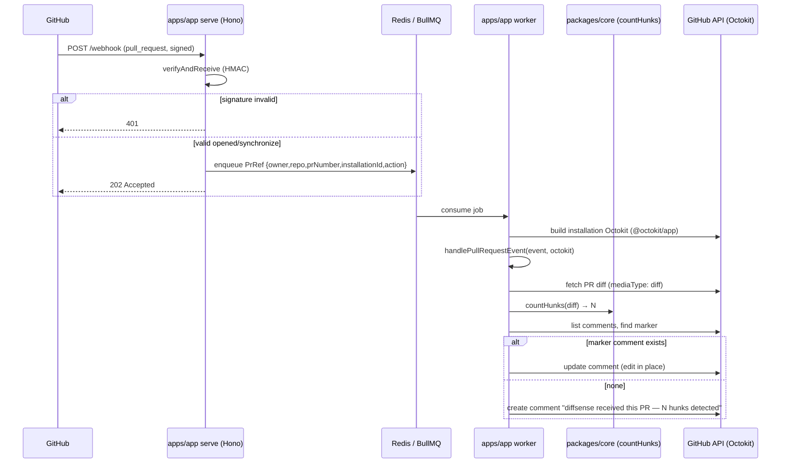

# feat: Project scaffold + GitHub App ingress + placeholder comment

**Origin:** GitHub issue [#1](https://github.com/robert197/diffsense/issues/1) — `ready-for-agent`
**Type:** feat · **Depth:** Deep (greenfield, cross-cutting: monorepo + ingress + queue + DB + Docker)
**Grounded in:** `docs/STACK.md`, `docs/ARCHITECTURE.md`, `STRATEGY.md`, `CLAUDE.md`

---

## Summary

The first codeable slice of diffsense: a running TypeScript GitHub App that receives PR webhooks, acks fast, enqueues a BullMQ review job, and a worker that fetches the PR diff and posts **one** placeholder comment ("diffsense received this PR — N hunks detected"), editing that same comment in place on `synchronize`. Packaged as a multi-stage Docker image (roles `serve`/`worker`/`web`) bootable via `docker compose up` with app, worker, postgres, redis. This is the skeleton every later slice plugs into — the integration seam is `handlePullRequestEvent(event, octokit)` in `apps/app`.

This slice builds the **deterministic shell** only: ingress, queue, worker, delivery, persistence. No ranking, no LLM, no review pipeline (those are #2, #7, #8+). `packages/core` and `packages/llm` stay minimal/stub; `apps/web` is a placeholder container.

---

## Problem Frame

diffsense's architecture (`docs/ARCHITECTURE.md`) is ports-&-adapters: a deterministic pipeline shell in `apps/app` wiring pure domain logic in `packages/core` to adapters (github/Octokit, db/Drizzle, llm/AI SDK). Nothing exists yet. Before any risk-ranking or LLM review can be built, the repo needs the runnable skeleton: the webhook ingress, the queue/worker durability boundary (required because real reviews run minutes), idempotent comment delivery, and the persistence + container plumbing. Getting the integration seam (`handlePullRequestEvent`) and the queue boundary right now is what lets every later slice be a pure addition rather than a re-plumb.

---

## Requirements (traceability to issue #1 acceptance criteria)

- **R1** — pnpm monorepo scaffolded (`packages/core`, `packages/llm` stub, `apps/app`, `apps/web` stub); `pnpm test` green in CI; Biome configured. → U1, U2
- **R2** — Hono endpoint verifies webhook signature and enqueues a BullMQ job; a worker consumes it. → U4, U5
- **R3** — Opening a PR (or replaying the fixture) posts exactly one placeholder comment naming the hunk count. → U5
- **R4** — `synchronize` edits the same comment in place — no second comment, no notification spam. → U5
- **R5** — `handlePullRequestEvent(event, octokit)` has an integration test using a recorded webhook payload + fake Octokit. → U5
- **R6** — Postgres + baseline Drizzle migration verified by a test round-trip. → U3
- **R7** — `docker compose up` boots app + worker + postgres + redis; the app is reachable and processes a replayed webhook end-to-end. → U6
- **R8** — README documents the one-time GitHub App registration and the local-dev (smee/fixture) path. → U7

---

## Key Technical Decisions

- **KTD1 — `parse-diff` for hunk counting, exposed as a pure `core` function.** The placeholder needs "N hunks detected". Fetch the PR diff via Octokit with `mediaType: { format: "diff" }`, parse with `parse-diff`, and count hunks via a tiny pure `countHunks(diff: string): number` in `packages/core/diff`. Adds the `parse-diff` dep now (issue says "used by #2") and gives `core` its first real, trivially-unit-testable function rather than a pure stub. The Octokit fetch (I/O) lives in `apps/app`; the counting (pure) lives in `core` — honoring the dependency-points-inward rule.
- **KTD2 — Idempotent comment upsert by marker, not stored ID (this slice).** To satisfy "edit the same comment on `synchronize`", the worker lists existing issue comments, finds the one authored by the app containing a hidden HTML marker (`<!-- diffsense:pr-review -->`), and edits it; if none, creates it. Marker-based lookup keeps this slice free of a comment-ID table while still being idempotent and surviving worker restarts. (A `FindingStore`-backed comment ID is a #12 concern; not pulled in here.)
- **KTD3 — `@octokit/webhooks` verifies + parses; Hono only transports.** The Hono route reads the raw body and passes it to `@octokit/webhooks`'s `verifyAndReceive` (HMAC signature check). On a verified `pull_request` event (`opened`, `synchronize`), the handler extracts a minimal `PrRef` (`owner`, `repo`, `prNumber`, `installationId`, `action`) and enqueues it, then returns 202 immediately. Signature failures return 401. The actual Octokit client is constructed in the worker from the installation id via `@octokit/app`, not in the ingress — ingress stays fast and stateless.
- **KTD4 — BullMQ job payload is the serializable `PrRef`, not the webhook blob.** Keeps the queue payload small and stable; the worker reconstructs an installation-scoped Octokit and calls `handlePullRequestEvent`. Redis connection from `REDIS_URL`.
- **KTD5 — `handlePullRequestEvent(event, octokit)` is the single seam.** It takes an already-narrowed event object + a ready Octokit (real in prod, fake in tests). All later slices (`runReview`) plug in here. Worker is a thin adapter: deserialize job → build Octokit → call the seam. This is what makes R5 testable without a queue or network.
- **KTD6 — Drizzle with a baseline migration; one table this slice.** A minimal `events` (or `processed_events`) table proves the connection + migration runner round-trip (R6). Schema kept deliberately tiny; real domain tables (`findings`, `fingerprints`, `cost`) arrive with their slices. `DATABASE_URL` drives the connection, defaulting to the compose postgres but accepting any host (STACK rule).
- **KTD7 — One multi-stage Dockerfile, role-selected by command.** `serve` (Hono), `worker` (BullMQ consumer), `web` (Next.js stub). `docker-compose.yml` wires app/worker/web/postgres/redis; Caddy optional this slice (document but not required for `up`). Migrations run via a one-shot step/entrypoint guard.
- **KTD8 — Provider-independence preserved by omission.** No LLM code this slice. `packages/llm` is a stub exporting a typed placeholder so the workspace graph is complete. `packages/core` defines no vendor imports.

---

## High-Level Technical Design

End-to-end flow this slice delivers (the deterministic shell, no review pipeline yet):



Layering (dependency points inward — `docs/ARCHITECTURE.md` §1): `apps/app` (I/O shell) → `packages/core` (pure `countHunks`). `packages/core` imports nothing vendor-specific.

---

## Output Structure

Expected greenfield layout after this slice (authoritative per-unit `**Files:**` lists below; tree is the shape, not a constraint):

```
diffsense/
├── package.json                  # workspace root, scripts
├── pnpm-workspace.yaml
├── tsconfig.base.json
├── biome.json
├── vitest.config.ts              # or per-package
├── .github/workflows/ci.yml
├── Dockerfile                    # multi-stage, role-selected
├── docker-compose.yml
├── .env.example
├── drizzle.config.ts
├── packages/
│   ├── core/
│   │   ├── package.json
│   │   ├── src/diff/countHunks.ts
│   │   ├── src/diff/countHunks.test.ts
│   │   └── src/index.ts
│   └── llm/
│       ├── package.json
│       └── src/index.ts          # stub
└── apps/
    ├── app/
    │   ├── package.json
    │   ├── src/ingress/server.ts        # Hono + webhook verify
    │   ├── src/queue/producer.ts        # BullMQ enqueue
    │   ├── src/worker/index.ts          # consumer → handlePullRequestEvent
    │   ├── src/worker/handlePullRequestEvent.ts   # the seam
    │   ├── src/worker/handlePullRequestEvent.test.ts
    │   ├── src/adapters/github.ts       # Octokit comment upsert helpers
    │   ├── src/db/client.ts             # Drizzle connection
    │   ├── src/db/schema.ts
    │   ├── src/db/db.test.ts            # round-trip
    │   ├── src/config.ts                # env parsing
    │   ├── src/main.ts                  # role dispatch (serve|worker)
    │   └── test/fixtures/pull_request.opened.json
    └── web/
        ├── package.json
        └── (Next.js stub — minimal page + container start)
```

---

## Implementation Units

### U1. Monorepo scaffold + tooling + CI

**Goal:** A working pnpm monorepo with Biome, Vitest, shared tsconfig, and CI running `pnpm test` green.
**Requirements:** R1
**Dependencies:** none
**Files:** `package.json`, `pnpm-workspace.yaml`, `tsconfig.base.json`, `biome.json`, `vitest.config.ts`, `.github/workflows/ci.yml`, `.gitignore`, `.env.example`
**Approach:** pnpm workspace declaring `packages/*` and `apps/*`. Root scripts: `test` (vitest), `lint`/`format` (Biome), `typecheck` (tsc --build). Node 22 in `engines` and CI matrix. `biome.json` with sensible defaults (format + lint). CI workflow: checkout → setup-node 22 → `pnpm install --frozen-lockfile` → `pnpm lint` → `pnpm typecheck` → `pnpm test`. `.env.example` lists all secrets from `docs/STACK.md` §Secrets.
**Patterns to follow:** STACK.md repo-layout table; standard pnpm-workspace + Biome conventions.
**Test scenarios:** `Test expectation: none -- scaffolding/config only. Validation is "pnpm install && pnpm test exits 0 with at least one placeholder test discovered" and CI green.`
**Verification:** `pnpm install` resolves the workspace; `pnpm test` runs and passes; CI workflow runs the same and is green on push.

### U2. `packages/core` (pure) + `packages/llm` stub

**Goal:** `core` package with its first pure function `countHunks` and a Zod-ready structure; `llm` as a typed stub. No vendor imports in `core`.
**Requirements:** R1 (workspace completeness), supports R3 (hunk count)
**Dependencies:** U1
**Files:** `packages/core/package.json`, `packages/core/src/index.ts`, `packages/core/src/diff/countHunks.ts`, `packages/core/src/diff/countHunks.test.ts`, `packages/llm/package.json`, `packages/llm/src/index.ts`
**Approach:** `countHunks(diff: string): number` uses `parse-diff` to parse a unified diff and sums hunk (`chunks`) counts across files. Pure, deterministic, no I/O. Export from `core/index.ts`. `packages/llm` exports a placeholder type/const so the workspace graph and later `LLMProvider` adapter slot exist; it imports nothing vendor-specific yet. Add `parse-diff` as a `core` dependency.
**Patterns to follow:** ARCHITECTURE.md §4 (`core/diff/` holds pure parse helpers); CLAUDE.md non-negotiable: `core` imports no vendor SDK.
**Test scenarios:**
- Happy path: a multi-file unified diff with known hunk counts → returns the exact sum (e.g., 2 files × 2 hunks = 4).
- Edge: empty diff string → returns 0.
- Edge: single-file single-hunk diff → returns 1.
- Edge: diff with a new file (no `@@` context variations) and a deletion → counted correctly.
**Verification:** `countHunks` tests pass; `core` has no `@ai-sdk/*`/`@anthropic-ai/*`/Octokit/Drizzle imports (grep clean).

### U3. Drizzle + Postgres connection + baseline migration + round-trip test

**Goal:** A typed Drizzle connection from `DATABASE_URL`, a baseline migration with one minimal table, and a test proving a write/read round-trip.
**Requirements:** R6
**Dependencies:** U1
**Files:** `drizzle.config.ts`, `apps/app/package.json`, `apps/app/src/db/client.ts`, `apps/app/src/db/schema.ts`, `apps/app/src/db/migrations/` (baseline), `apps/app/src/db/db.test.ts`, `apps/app/src/config.ts`
**Approach:** Drizzle schema with one minimal table (e.g., `processed_events { id, delivery_id, action, created_at }`) — small, just enough to prove the round-trip and give later slices a migration baseline. `client.ts` builds the pool from `DATABASE_URL` (default points at compose postgres, accepts any host). Migration runner via `drizzle-kit` generate + a programmatic `migrate()` applied in the test setup. `config.ts` parses env (validate `DATABASE_URL`, `REDIS_URL`, GitHub secrets) — used across ingress/worker too.
**Patterns to follow:** STACK.md DB row; ARCHITECTURE.md db adapter behind a port (full `*Store` ports deferred to their slices — this slice only proves the plumbing).
**Execution note:** The round-trip test needs a real Postgres. Gate it to run against the compose/CI postgres service (skip or use a testcontainer if unavailable locally) so CI proves R6 without flaking on dev machines.
**Test scenarios:**
- Integration (R6): apply baseline migration to a clean DB, insert one `processed_events` row, read it back, assert fields match.
- Edge: missing/invalid `DATABASE_URL` → `config.ts` throws a clear error at startup (fail fast).
**Verification:** Migration applies cleanly; round-trip test passes against the CI postgres service.

### U4. Hono ingress: webhook verify + BullMQ producer

**Goal:** A Hono endpoint that verifies `pull_request` webhook signatures, narrows to `opened`/`synchronize`, enqueues a `PrRef` BullMQ job, and acks 202 fast. Invalid signatures → 401.
**Requirements:** R2
**Dependencies:** U1, U3 (config)
**Files:** `apps/app/src/ingress/server.ts`, `apps/app/src/queue/producer.ts`, `apps/app/src/ingress/server.test.ts`, `apps/app/src/types.ts` (defines `PrRef`)
**Approach:** Hono app with `POST /webhook` reading the raw body. Use `@octokit/webhooks` `Webhooks({ secret })` + `verifyAndReceive({ id, name, signature, payload })` for HMAC verification and parsing. On a verified `pull_request` with action in `{opened, synchronize}`, extract `PrRef = { owner, repo, prNumber, installationId, action, deliveryId }` and call the producer (`reviewQueue.add('review', prRef)`); respond 202. Non-target actions → 204/no-op. Bad signature → 401. Producer constructs a BullMQ `Queue` from `REDIS_URL`. Add a `GET /healthz` for compose readiness (supports R7).
**Patterns to follow:** STACK.md HTTP=Hono, jobs=BullMQ+Redis; KTD3/KTD4.
**Test scenarios:**
- Happy path (R2): POST a signed `pull_request.opened` fixture → 202 and the producer is called once with the correct `PrRef`.
- `synchronize` action → enqueued with `action: "synchronize"`.
- Error path: invalid signature → 401, producer not called.
- Edge: `pull_request` with a non-target action (e.g., `closed`) → no enqueue, 204.
- Edge: non-`pull_request` event → no enqueue.
**Verification:** Ingress tests pass with a fake/mocked queue producer; signature verification rejects tampered payloads.

### U5. Worker + `handlePullRequestEvent` seam + idempotent comment + integration test

**Goal:** A BullMQ worker that consumes the job, builds an installation Octokit, and calls `handlePullRequestEvent(event, octokit)` — which fetches the diff, counts hunks, and upserts exactly one marker-tagged placeholder comment (create on first, edit in place on `synchronize`). Integration-tested with a recorded payload + fake Octokit.
**Requirements:** R3, R4, R5
**Dependencies:** U2 (countHunks), U4 (PrRef type/queue)
**Files:** `apps/app/src/worker/index.ts`, `apps/app/src/worker/handlePullRequestEvent.ts`, `apps/app/src/adapters/github.ts`, `apps/app/src/worker/handlePullRequestEvent.test.ts`, `apps/app/test/fixtures/pull_request.opened.json`, `apps/app/test/fixtures/pull_request.synchronize.json`
**Approach:** `handlePullRequestEvent(event, octokit)` is the single integration seam (KTD5): fetch PR diff (`octokit.rest.pulls.get` with `mediaType: { format: "diff" }`), `countHunks(diff)` from `core`, then upsert. Upsert helper in `adapters/github.ts`: list issue comments, find one whose body contains `<!-- diffsense:pr-review -->`; if found `issues.updateComment`, else `issues.createComment` with body `"<!-- diffsense:pr-review -->\ndiffsense received this PR — N hunks detected"`. Worker (`worker/index.ts`) is a thin adapter: BullMQ `Worker` consuming from `REDIS_URL`, deserialize `PrRef`, build installation-scoped Octokit via `@octokit/app`, narrow into the event shape, call the seam. Composition root per ARCHITECTURE.md §4.
**Patterns to follow:** KTD2 (marker upsert), KTD5 (seam), ARCHITECTURE.md §2 "comment upsert — exactly one comment, edited in place. Idempotent delivery."
**Execution note:** Start with a failing integration test for the `handlePullRequestEvent` contract using the recorded payload + fake Octokit, then implement to green (this is the seam every later slice depends on — lock its contract first).
**Test scenarios:**
- Integration happy path (R3, R5): `opened` fixture + fake Octokit returning a known diff → exactly one `createComment` call with body containing the correct hunk count and the marker; no `updateComment`.
- Idempotency (R4): `synchronize` fixture + fake Octokit whose comment list already contains a marker comment → exactly one `updateComment` (same comment id), zero `createComment`.
- Edge: no existing marker comment on `synchronize` → falls back to create (one comment, no duplicate spam).
- Edge: diff with 0 hunks → comment still posts, "0 hunks detected".
- Error path: Octokit diff fetch rejects → job throws (BullMQ retry); no partial/duplicate comment created.
- Worker wiring: a job consumed → `handlePullRequestEvent` invoked once with the deserialized event and a built Octokit (mock the seam to assert wiring).
**Verification:** Integration tests green; replaying `opened` then `synchronize` yields exactly one comment, edited in place.

### U6. Multi-stage Dockerfile + docker-compose

**Goal:** One multi-stage Dockerfile (roles `serve`/`worker`/`web`) and a `docker-compose.yml` that boots app + worker + postgres + redis; replaying a webhook flows end-to-end.
**Requirements:** R7
**Dependencies:** U3, U4, U5 (and U7 web stub buildable)
**Files:** `Dockerfile`, `docker-compose.yml`, `.dockerignore`, migration entrypoint/one-shot (e.g., `docker/entrypoint.sh` or compose `migrate` profile)
**Approach:** Multi-stage build: deps → build (pnpm) → runtime; `CMD`/entrypoint selects role from an arg/env (`ROLE=serve|worker|web`). `docker-compose.yml` services: `app` (serve, exposes the Hono port, `healthz`), `worker`, `web` (stub), `postgres` (named volume), `redis`. A `migrate` one-shot (compose profile or entrypoint guard) applies Drizzle migrations before serve/worker start. `.env` supplies secrets; `DATABASE_URL`/`REDIS_URL` default to the compose services. Caddy documented as optional this slice (not required for `up`).
**Patterns to follow:** STACK.md §Docker/self-host (KTD7); ARCHITECTURE.md §7.
**Test scenarios:** `Test expectation: none -- infra. Validation is the manual/CI smoke: docker compose up boots app+worker+postgres+redis, GET /healthz returns 200, and a replayed signed webhook (smee or curl with valid signature) results in exactly one PR comment end-to-end.`
**Verification:** `docker compose up` brings all four services healthy; replayed webhook produces the placeholder comment; migrations applied on boot.

### U7. `apps/web` stub + README (GitHub App registration + local-dev path)

**Goal:** A minimal Next.js `web` container that builds and starts (placeholder page), and a README documenting the one-time GitHub App registration and the smee.io/fixture local-dev path.
**Requirements:** R1 (web stub), R8
**Dependencies:** U1
**Files:** `apps/web/package.json`, `apps/web/` minimal Next.js app (one page), `README.md` (update), `docs/` link if needed
**Approach:** Next.js stub: one page rendering a placeholder ("diffsense card view — coming soon"), buildable and runnable as the `web` role/container so compose's web service starts. README section: (1) one-time GitHub App registration in the GitHub UI capturing `GITHUB_APP_ID`, `GITHUB_PRIVATE_KEY`, `GITHUB_WEBHOOK_SECRET` (with required permissions: PR read, issue/comment write; subscribe to `pull_request`); (2) local-dev via smee.io channel forwarding to the local Hono endpoint, or replaying the recorded fixture so coding doesn't block on registration; (3) `docker compose up` quickstart and `.env` setup.
**Patterns to follow:** STACK.md (web = Next.js own container); issue "Human prerequisite" note (document, not deliverable).
**Test scenarios:** `Test expectation: none -- stub UI + docs. Validation: web stub builds and serves the placeholder page; README steps are accurate and complete per the acceptance criteria.`
**Verification:** `apps/web` builds and serves the placeholder; README documents registration + smee/fixture clearly.

---

## Scope Boundaries

**In scope:** monorepo scaffold, tooling, CI; webhook ingress + signature verify; BullMQ producer/consumer; `handlePullRequestEvent` seam; idempotent placeholder comment; Postgres + baseline migration round-trip; Docker + compose; web stub; README docs.

### Deferred to Follow-Up Work
- **Caddy reverse proxy / auto-TLS** — documented optional this slice; full TLS wiring deferred (production hardening).
- **Real `*Store` ports** (`FindingStore`, `FingerprintCache`, `CostStore`, etc.) and their tables — arrive with their owning slices (#8, #12).
- **Comment-ID persistence** for upsert — this slice uses a marker; a stored comment id is a #12 concern.

### Outside this slice (other issues)
- Structural ranking / `rankHunks` (#2), context tools (#7), LLM review unit + fingerprint cache (#8), verify (#9), scope-creep (#10), synthesis (#11), enriched comment + cost (#12), hosted card view real implementation (#13).
- Any LLM/provider code — `packages/llm` stays a stub (KTD8).

---

## Risks & Dependencies

- **R-DB-in-test (R6):** the round-trip test needs a real Postgres. Mitigation: gate it to the CI/compose postgres service (U3 execution note); don't depend on a dev-local DB for the unit suite.
- **Webhook signature correctness (R2):** getting raw-body handling wrong silently breaks HMAC. Mitigation: test with both valid and tampered payloads (U4); use `@octokit/webhooks` rather than hand-rolling.
- **Idempotency regressions (R4):** the marker-lookup must be exact or `synchronize` spams comments. Mitigation: explicit integration test asserting one `updateComment` / zero `createComment` (U5).
- **Workspace build ordering in Docker (R7):** pnpm monorepo builds need correct stage caching. Mitigation: deps→build→runtime stages; `.dockerignore`; role-selected runtime.
- **Provider-independence drift:** accidental vendor import in `core`. Mitigation: keep `llm` a stub; grep-clean check in U2 verification; CLAUDE.md rule.

---

## Sources & Research

- `docs/STACK.md` — locked stack (pnpm monorepo, Hono, Octokit, BullMQ+Redis, Drizzle/Postgres, Vitest+Biome, parse-diff, Docker roles, secrets list).
- `docs/ARCHITECTURE.md` — ports & adapters, deterministic pipeline shell, the `handlePullRequestEvent`/`runReview` seam, component layout, idempotent delivery.
- `STRATEGY.md` — advisory-in-GitHub posture (placeholder comment is the first advisory surface).
- `CLAUDE.md` — non-negotiables: `core` imports no vendor SDK; deterministic shell vs agentic review unit; self-host only.
- GitHub issue #1 — acceptance criteria (R1–R8 traceability above).
