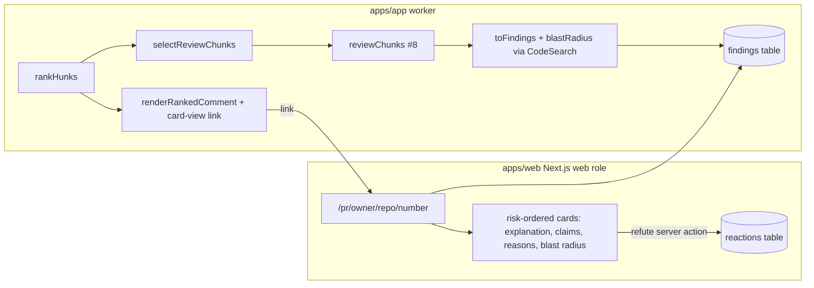

# feat: Hosted card review view (#13)

## Summary

Build the hosted reviewer surface for issue #13: a Next.js read-model (`apps/web`)
that renders one card per reviewed chunk, ordered by risk, showing the
explanation, falsifiable claims, risk reasons, and blast radius. Each claim gets a
one-click refute affordance that records a 👎 reaction against the finding's chunk
fingerprint, reusing the existing precision-signal pipeline. The PR comment links
to the view. The surface is advisory: it exposes no merge control.

The card view is a read-model over a `FindingStore`. Today nothing persists
per-chunk reviews — the worker only ranks hunks and posts the ranked comment. So
this slice also introduces the `FindingStore` port + `findings` table + Drizzle
adapter, and wires the existing `reviewChunks` primitive (#8) into the worker
behind **optional** injected deps so findings get produced and persisted. When
those deps are absent (no LLM configured) the worker behaves exactly as today —
all existing tests and the no-LLM deployment stay green.

Out of scope: verify / scope-creep / synthesis (#9/#10/#11). The card is the
per-chunk review view, not the synthesized portfolio.

---

## Problem Frame

Issue #13 wants a hosted card view linked from the PR comment, presenting per-chunk
review detail with a refute affordance, ordered by risk, advisory only.

The blocker (#8) delivered the `reviewChunks` core primitive and the fingerprint
cache, but never wired review-output persistence. There is no `findings` table and
no `FindingStore`. So the view has no data source. The honest minimum is therefore
two things at once: a persisted findings contract fed by a real (optional) review
pass, and the view that reads it.

Constraints (CLAUDE.md / STACK.md, non-negotiable):
- `packages/core` imports no vendor SDK — pure domain + Zod + ports.
- LLM only via the `LLMProvider` port; provider/model from env.
- Pipeline deterministic; only the per-chunk review unit is agentic.
- Self-host Docker only; `apps/web` runs as the `web` role against shared Postgres.
- `apps/web` cannot import `apps/app` — it needs its own minimal DB module.

---

## Requirements Traceability

| Acceptance criterion (#13) | Where satisfied |
|---|---|
| 1. One card per reviewed chunk, ordered by risk, with explanation + claims + reasons + blast radius | U1 (schema/port), U2 (table/adapter), U5 (web view) |
| 2. Each claim has one-click refute → records signal against finding + chunk fingerprint | U5 (refute action) reusing `reactions` table via U4 web ReactionStore |
| 3. Reachable from the PR-thread comment link, no GitHub install | U3 (comment link) + U5 (route) |
| 4. Advisory — no merge-gating control | U5 (no merge UI; refute writes a reaction only) |
| 5. `apps/web` builds and runs as the `web` container against shared Postgres | U4 (web db module), U6 (compose DATABASE_URL), CI `next build` |

---

## Key Technical Decisions

- **`Finding` is the card-ready persisted record**, distinct from `ChunkReview`.
  It carries the chunk identity + risk ordering + the `ChunkReview` content
  (explanation/claims/reasons) **plus** `blastRadius: string[]`, which
  `ChunkReview` does not have. Blast radius is derived deterministically in the
  worker from `CodeSearch.findCallSites` for the reviewed chunk, bounded to a small
  cap. Keeping blast radius on `Finding` (not `ChunkReview`) avoids touching #8's
  schema and the fingerprint cache contract.
- **Refute reuses the existing precision signal.** A refute = a `ChunkReaction`
  with `sentiment: "down"` keyed by the finding's `fingerprint` + `tier`, written
  to the same `reactions` table the comment 👍/👎 already feed. This satisfies
  "records the signal against the finding and the chunk fingerprint" without a new
  reaction schema. Per-claim buttons all map to the one finding fingerprint (claims
  belong to one chunk); refuting any claim signals the finding is noise.
- **Review wiring is optional and injected.** `handlePullRequestEvent` gains an
  optional `review` dep bundle (`llm`, `cache`, `tools`, `codeSearch`,
  `findingStore`, and a `webBaseUrl`). Present → run `reviewChunks` over selected
  chunks, build findings, persist, and add the card-view link to the comment.
  Absent → unchanged behavior. This keeps the deterministic ranking path intact and
  every existing test passing, and makes the LLM path opt-in at the composition
  root (guarded by LLM availability).
- **`apps/web` owns a tiny DB module.** It cannot import `apps/app`. It declares the
  minimal Drizzle table shapes it reads/writes (`findings`, `reactions`) and a
  `postgres`/`drizzle-orm` client over the shared `DATABASE_URL`. Column shapes must
  match the migration in U2. This is intentional, isolated duplication, not a shared
  package (a shared schema package is deferred).
- **Route shape:** `apps/web/app/pr/[owner]/[repo]/[number]/page.tsx` — a server
  component that lists findings for the PR ordered by risk. The comment link points
  here. Refute is a Next.js server action that writes the reaction.
- **`web` role stays on `next dev`** (current entrypoint). CI proves `next build`
  succeeds (criterion 5: "builds and runs"). Switching the container to
  `next start` is deferred — out of scope for this slice.

---

## High-Level Technical Design

When the `review` deps are absent, the `S→RV→M→FS` branch and the card-view link
are skipped; the worker just ranks and comments as it does today.

---

## Implementation Units

### U1. `Finding` schema + `FindingStore` port (core)

**Goal:** Define the card-ready persisted record and its port. Pure, no I/O.

**Requirements:** Criterion 1, 2.

**Dependencies:** none.

**Files:**
- `packages/core/src/schemas/finding.ts` (new) — `FindingSchema` Zod object.
- `packages/core/src/schemas/finding.test.ts` (new).
- `packages/core/src/ports/findingStore.ts` (new) — `FindingStore` interface.
- `packages/core/src/index.ts` (modify) — export both.

**Approach:** `FindingSchema` fields: `owner`, `repo`, `prNumber` (positive int),
`fingerprint` (min 1), `file` (min 1), `tier` (`High|Medium|Low`), `rank`
(non-negative int — risk order within the PR, 0 = highest), `explanation` (min 1),
`claims` (array of the existing `ReviewClaim` — import from `chunkReview.ts`),
`reasons` (`string[]`, min 1), `blastRadius` (`string[]`, may be empty). Reuse
`ReviewClaim` and the tier enum already in the codebase; do not redefine them.
`FindingStore` port: `record(finding: Finding): Promise<void>` and
`listByPr(ref: { owner; repo; prNumber }): Promise<Finding[]>` returning findings
ordered by risk (rank ascending). Match the comment density and JSDoc style of
`schemas/reaction.ts` and `ports/reactionStore.ts`.

**Patterns to follow:** `packages/core/src/schemas/reaction.ts`,
`packages/core/src/ports/reactionStore.ts`, `schemas/chunkReview.ts` (`ReviewClaim`).

**Test scenarios** (`finding.test.ts`):
- Valid finding parses; `tier` outside enum rejected.
- `reasons` empty array rejected (min 1); `claims` empty array allowed.
- `blastRadius` empty array allowed; `prNumber` zero/negative rejected.
- `rank` negative rejected.

**Verification:** `pnpm test` covers the schema; `pnpm typecheck` passes with the
new exports.

---

### U2. `findings` table + migration + Drizzle `FindingStore` adapter (apps/app)

**Goal:** Persist findings and read them back ordered by risk.

**Requirements:** Criterion 1, 5.

**Dependencies:** U1.

**Files:**
- `apps/app/src/db/schema.ts` (modify) — add `findings` pgTable.
- `apps/app/src/db/migrations/0005_findings.sql` (new) — hand-written DDL.
- `apps/app/src/db/migrations/meta/_journal.json` (modify) — add journal entry.
- `apps/app/src/adapters/findingStore.ts` (new) — Drizzle adapter.
- `apps/app/src/adapters/findingStore.test.ts` (new) — unit test with a fake/mock db, mirroring existing adapter test style.

**Approach:** `findings` columns: `id serial pk`, `owner text`, `repo text`,
`pr_number int`, `fingerprint text`, `file text`, `tier text`, `rank int`,
`explanation text`, `claims jsonb`, `reasons jsonb`, `blast_radius jsonb`,
`created_at timestamptz default now()`. No unique constraint required for this
slice (re-review appends; the view can show the latest run — keep it simple:
`listByPr` orders by `rank asc, id desc` so newest rows win ties). Adapter
`record` inserts; `listByPr` selects by `(owner, repo, pr_number)` ordered by
`rank asc, id desc`, re-validates each row through `FindingSchema` (jsonb columns
parsed back), returns `Finding[]`. Follow the migration numbering and `_journal.json`
shape of `0004_costs.sql`. Match `fingerprintCache.ts`/`costStore.ts` adapter style
(re-validate jsonb on read like `fingerprints.review`).

**Patterns to follow:** `apps/app/src/db/migrations/0004_costs.sql`,
`apps/app/src/adapters/fingerprintCache.ts`, `apps/app/src/adapters/costStore.ts`,
`apps/app/src/db/schema.ts` (the `fingerprints`/`costs` tables).

**Test scenarios** (`findingStore.test.ts`):
- `record` issues an insert with the mapped column values (jsonb fields serialized).
- `listByPr` builds the right where/order and maps rows back to validated `Finding`s.
- A row whose jsonb fails `FindingSchema` surfaces as an error (no silent drop) — mirror how other adapters treat invalid cached rows.

**Verification:** adapter unit test green; `pnpm db:migrate` applies `0005`
cleanly against a fresh Postgres (verified in CI/compose, not asserted in unit test).

---

### U3. `ReviewResult → Finding` mapper + card-view comment link (core)

**Goal:** Pure mapping from review output to findings, and a comment affordance
linking to the hosted view.

**Requirements:** Criterion 1, 3.

**Dependencies:** U1.

**Files:**
- `packages/core/src/review/toFindings.ts` (new) — `toFindings(results, ctx)` mapping `ReviewResult[]` → `Finding[]`; `ctx` carries `{ owner, repo, prNumber }` and a per-fingerprint `blastRadius` lookup (resolved in the worker, passed in — keeps `core` pure: no CodeSearch call inside).
- `packages/core/src/review/toFindings.test.ts` (new).
- `packages/core/src/render/cardViewLink.ts` (new) — `cardViewLink(webBaseUrl, { owner, repo, prNumber })` → URL string for `/pr/{owner}/{repo}/{number}`.
- `packages/core/src/render/cardViewLink.test.ts` (new).
- `packages/core/src/render/renderRankedComment.ts` (modify) — append a "View the full risk cards →" link when an optional `cardViewUrl` is provided; render unchanged when absent.
- `packages/core/src/render/renderRankedComment.test.ts` (modify) — cover both branches.
- `packages/core/src/index.ts` (modify) — export `toFindings`, `cardViewLink`.

**Approach:** `toFindings` assigns `rank` by the order of `results` (already
risk-selected/ordered upstream), copies `explanation`/`claims`/`reasons` from
`review`, maps `chunk.tier`→`tier`, `chunk.file`→`file`, `fingerprint`→`fingerprint`,
and sets `blastRadius` from the passed lookup (`[]` when none). `cardViewLink`
trims a trailing slash like `reactionLink.ts` does and URL-encodes path segments.
The comment change is additive and gated on the optional arg so existing callers
and snapshots are unaffected unless they pass the new arg.

**Patterns to follow:** `packages/core/src/render/reactionLink.ts` (URL building,
trailing-slash trim), `packages/core/src/render/renderRankedComment.ts`,
`review/reviewPass.ts` (`ReviewResult` shape).

**Test scenarios:**
- `toFindings`: maps fields correctly; `rank` follows input order; missing blast-radius entry → `[]`; empty results → `[]`.
- `cardViewLink`: builds `/pr/o/r/12`; trims trailing slash on base; encodes a segment with a special char.
- `renderRankedComment`: with `cardViewUrl` the link line is present and points at the URL; without it the output is byte-identical to today (guard the existing snapshot/assertions).

**Verification:** `pnpm test` green for core render + review; existing
`renderRankedComment` assertions unchanged on the no-link branch.

---

### U4. `apps/web` DB module: read findings, write refute reaction

**Goal:** Give `apps/web` its own minimal Postgres access over the shared DB.

**Requirements:** Criterion 1, 2, 5.

**Dependencies:** U2 (column shapes must match the migration).

**Files:**
- `apps/web/package.json` (modify) — add `drizzle-orm`, `postgres`, and `zod` (or import shapes locally); add `@diffsense/core` if reusing `FindingSchema`/`ReviewClaim` types (core is pure and safe to import from web).
- `apps/web/lib/db.ts` (new) — drizzle client over `DATABASE_URL`; declare `findings` and `reactions` table shapes matching U2 and the existing `reactions` table.
- `apps/web/lib/findings.ts` (new) — `listFindings({ owner, repo, prNumber })` returning risk-ordered findings (validate via `@diffsense/core` `FindingSchema`); `recordRefute({ owner, repo, prNumber, fingerprint, tier })` inserting a `sentiment: "down"` reaction.
- `apps/web/lib/db.test.ts` or `apps/web/lib/findings.test.ts` (new, if feasible without a live DB) — at minimum unit-test the row→`Finding` mapping and the refute payload shape with a fake db; otherwise cover mapping logic in a pure helper.

**Approach:** Reuse `@diffsense/core` for the `Finding`/`ReviewClaim` types and
`ChunkReactionSchema` so web and app agree on shape (core imports no vendor SDK, so
importing it into web is fine and keeps a single source of truth). The `reactions`
insert mirrors the columns the app's `reactionStore` writes (`owner`, `repo`,
`pr_number`, `fingerprint`, `tier`, `sentiment`). Keep the client a lazy singleton
so Next.js dev/build doesn't open connections at import time when `DATABASE_URL`
is unset (build must not require a live DB).

**Patterns to follow:** `apps/app/src/db/client.ts`, `apps/app/src/db/schema.ts`
(`reactions`, and the new `findings` from U2), `apps/app/src/adapters/reactionStore.ts`.

**Test scenarios:**
- Row with jsonb claims/reasons/blast_radius maps to a validated `Finding`.
- `recordRefute` builds an insert with `sentiment: "down"` and the given tier/fingerprint.
- Client construction does not throw at import when `DATABASE_URL` is absent (lazy).

**Verification:** `pnpm --filter @diffsense/web build` succeeds without a live DB;
mapping unit test green.

---

### U5. `apps/web` card view route + refute server action

**Goal:** Render one risk-ordered card per finding with a one-click refute per claim.

**Requirements:** Criterion 1, 2, 3, 4.

**Dependencies:** U4.

**Files:**
- `apps/web/app/pr/[owner]/[repo]/[number]/page.tsx` (new) — async server component; loads findings via `lib/findings.ts`, renders cards.
- `apps/web/app/pr/[owner]/[repo]/[number]/actions.ts` (new) — `"use server"` `refute` action calling `recordRefute`.
- `apps/web/app/pr/[owner]/[repo]/[number]/RefuteButton.tsx` (new, if a client component is needed for the form) — minimal form posting to the action.
- `apps/web/app/page.tsx` (modify) — update the "coming soon" copy to point at the new route shape (small; remove the `#13` placeholder text).
- Optional: `apps/web/app/pr/[owner]/[repo]/[number]/page.test.tsx` — render test if the harness supports it; otherwise rely on the U4 mapping tests + build.

**Approach:** Card layout: per finding, show `file` + `tier` badge, `explanation`,
a list of `reasons`, a list of `claims` (claim + evidence), and `blastRadius` (call
sites, or "No call sites found" when empty). Each claim row has a refute `<form>`
whose server action records the 👎 reaction for the finding's `fingerprint` + `tier`.
After the action, revalidate the path so the UI can reflect a "refuted" hint
(optional; minimum is the write succeeds). Cards ordered by risk (the query already
orders by rank). **No merge/approve/block controls anywhere** — advisory only
(criterion 4). Keep styling inline/simple consistent with the existing
`layout.tsx`/`page.tsx` (dark theme). Empty state: "No findings for this PR yet."

**Patterns to follow:** existing `apps/web/app/layout.tsx` + `page.tsx` styling;
Next.js 15 app-router server components + server actions.

**Test scenarios:**
- Findings present → one card per finding in risk order, each showing explanation/claims/reasons/blast radius. (Covers criterion 1.)
- Each claim renders a refute control; submitting it calls `recordRefute` with the finding fingerprint + tier + `down`. (Covers criterion 2.)
- No findings → empty-state message, no crash.
- No merge/approve/block affordance is rendered. (Covers criterion 4.)

**Verification:** `pnpm --filter @diffsense/web build` green; manual/dev render
shows risk-ordered cards and a working refute against a seeded row (compose).

---

### U6. Wire optional review path in worker + compose `web` DATABASE_URL

**Goal:** Produce + persist findings on review and link the comment; make the web
container read shared Postgres.

**Requirements:** Criterion 1, 3, 5.

**Dependencies:** U1, U2, U3.

**Files:**
- `apps/app/src/worker/handlePullRequestEvent.ts` (modify) — add optional `review` deps; when present: `selectReviewChunks` → `reviewChunks` → resolve `blastRadius` per chunk via `CodeSearch.findCallSites` (bounded cap) → `toFindings` → `findingStore.record` for each → pass `cardViewUrl` (from `cardViewLink(webBaseUrl, ...)`) into `renderRankedComment`. When absent: unchanged.
- `apps/app/src/worker/handlePullRequestEvent.test.ts` (modify) — add cases for the review-present path (fakes for llm/cache/tools/codeSearch/findingStore) and assert the existing no-deps path is unchanged.
- `apps/app/src/worker/index.ts` (modify) — construct the review deps only when LLM is available/configured (e.g., an `LLM_ENABLED`/API-key guard), else pass none; build `findingStore` adapter, `codeSearch`/`repoReader` adapters, `fingerprintCache`, `createLLMProvider`, review tools. Keep the no-LLM path identical to today.
- `apps/app/src/config.ts` (modify) — add optional `webBaseUrl` (`WEB_BASE_URL`) and any LLM-enable flag needed to gate wiring; keep all new config optional so existing startup is unaffected.
- `docker-compose.yml` (modify) — add `DATABASE_URL` (shared Postgres) to the `web` service env, and `WEB_BASE_URL` to `app`/`worker` so the comment can link.
- `.env.example` (modify) — document `WEB_BASE_URL` (and the LLM-enable flag if added).

**Approach:** Keep the review wiring small and guarded. Blast radius: derive a symbol
for the chunk cheaply (e.g., reuse what the review tools already expose, or run
`findCallSites` on the chunk's file/most-relevant symbol) and cap the list (e.g., 10
references) so the card stays glanceable and the call is bounded; tolerate empty
results (CodeSearch returns `[]`, never throws). Do not pull verify/scope/synthesis
into this path. The composition-root guard ensures a deployment without LLM keys runs
exactly as it does now (ranking + comment only, no findings, no card link).

**Patterns to follow:** existing `handlePullRequestEvent.ts` (injected ports,
fake-octokit tests), `worker/index.ts` (composition root building adapters),
`review/reviewPass.ts` (`selectReviewChunks`, `reviewChunks`), `config.ts` (optional
zod fields), `docker-compose.yml` (`x-app-env`).

**Test scenarios** (`handlePullRequestEvent.test.ts`):
- Review deps present: with a fake llm returning a `ChunkReview` and a fake findingStore, the handler persists one finding per selected chunk with the mapped fields + blast radius, and the upserted comment body contains the card-view link.
- Review deps present but no chunks selected (all Low, none opened): no findings persisted; comment still upserted.
- Review deps absent: behavior byte-identical to current test expectations (ranking + comment, no findingStore calls). (Regression guard.)
- `CodeSearch.findCallSites` returning `[]` → finding persisted with empty `blastRadius` (no throw).

**Verification:** full `pnpm test` green (new + existing); `pnpm typecheck` and
`pnpm lint` clean; `docker compose config` valid; `pnpm db:migrate` applies `0005`.

---

## Scope Boundaries

**In scope:** `FindingStore` port + schema; `findings` table + adapter; review→finding
mapper; optional worker review wiring producing/persisting findings; comment
card-view link; `apps/web` card route + refute; compose `DATABASE_URL` for web.

**Out of scope (this PR):**
- Verify / scope-creep / synthesis (#9/#10/#11) in the worker path.
- Per-claim refute granularity beyond the finding fingerprint (claims share the
  finding's fingerprint).
- Auth on the hosted view (advisory, public read like the existing reactions page).
- Switching the `web` container from `next dev` to `next start`.

### Deferred to Follow-Up Work
- A shared DB-schema package so `apps/web` and `apps/app` stop duplicating table
  shapes.
- Showing prior reactions / "refuted" state durably on the card (beyond optional
  path revalidation).
- Wiring verify/synthesis output into the cards.

---

## Risks & Dependencies

- **Web/app schema drift.** `apps/web/lib/db.ts` duplicates the `findings`/`reactions`
  column shapes. Mitigation: reuse `@diffsense/core` types for the row payloads and
  keep the column list adjacent to U2's migration; a render/build test catches shape
  errors.
- **Build must not need a live DB.** Next.js build/import must not open a Postgres
  connection. Mitigation: lazy client singleton; no top-level queries.
- **Regression in the deterministic path.** The worker change must not alter the
  no-LLM behavior. Mitigation: optional injected deps + an explicit regression test
  asserting the absent-deps path is unchanged.
- **Migration ordering.** `0005_findings.sql` must register in `_journal.json` with
  the correct idx/tag or `db:migrate` skips or misorders it. Mitigation: mirror
  `0004` exactly.

---

## Verification Strategy

Commands the implementer runs (pnpm monorepo, from repo root):
- `pnpm install` (web gains `drizzle-orm`/`postgres`).
- `pnpm test` — Vitest across core + app (+ web mapping tests if added).
- `pnpm typecheck` — tsc across packages.
- `pnpm lint` / `pnpm format` — Biome.
- `pnpm --filter @diffsense/web build` — proves criterion 5 (web builds).
- `docker compose config` — compose still valid with the new env.
- `pnpm db:migrate` against a fresh Postgres (compose `migrate` role) — `0005` applies.

Done = all of the above green, all five acceptance criteria demonstrably met, and
the existing worker no-LLM behavior unchanged.
