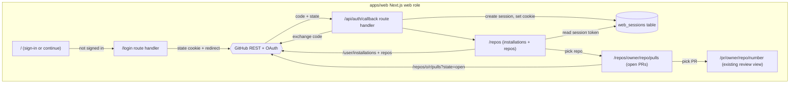

# feat: GitHub OAuth login + repo/PR picker (#25)

## Summary

Build the reviewer **entry path** for issue #25 in `apps/web`: a reviewer signs in
with their GitHub account (OAuth), the app persists their session, reads the GitHub
App installations / repositories that account can access, lets them pick a repo, and
shows that repo's **open** pull requests as a mobile-first list. Selecting a PR
navigates to the existing review entry point (`/pr/<owner>/<repo>/<number>`); deck /
deck-generation is a later slice and is explicitly out of scope.

End-to-end: OAuth authorize route → token exchange callback → DB-backed session
(opaque cookie, encrypted token at rest) → `GET /user/installations` +
`/user/installations/{id}/repositories` → repo list UI → `GET /repos/{o}/{r}/pulls?state=open`
→ open-PR list UI → link into the review view.

The slice lives **entirely in `apps/web`** plus one shared migration. `packages/core`
is untouched (so the no-vendor-SDK rule holds trivially), the `LLMProvider` port is
not involved (no LLM in this path), and the deterministic pipeline / worker is
unchanged. GitHub is the product's domain — a GitHub-specific OAuth + REST client in
the web shell does **not** violate the provider-agnostic rule, which governs the LLM
only. Self-host is respected: all auth secrets come from env, sessions persist in the
shared Postgres, no serverless/edge or managed-PaaS assumptions.

---

## Problem Frame

61.4% of AI-generated PRs receive no recorded review activity (issue #25 grounding).
The wedge is lowering entry friction to "open the app, see the PRs that need you."
Today `apps/web` only renders the per-PR card view (`/pr/...`, #13) reachable from a
link in the PR comment — there is no sign-in, no way to discover which repos/PRs are
available, and no session. A reviewer cannot get *into* the product on their own.

This slice adds the front door: authenticate the reviewer, remember them, and let
them navigate installations → repo → open PRs → review entry.

Constraints (CLAUDE.md / docs/STACK.md / docs/ARCHITECTURE.md, non-negotiable):
- `packages/core` imports no vendor SDK. **This slice does not touch `core`.**
- LLM access only via the `LLMProvider` port. **No LLM in this path.**
- Deterministic pipeline; only the per-chunk review unit is agentic. **Worker
  untouched.**
- Self-host only: Docker, shared Postgres/Redis, secrets from env, no serverless.
- `apps/web` cannot import `apps/app` — it owns its own minimal DB module (precedent:
  `apps/web/lib/db.ts` from #13).

This deliberately **extends `apps/web`** from a pure read-model into the
authenticated entry surface. That is exactly what issue #25 scopes ("OAuth route →
persisted user session → installations/repos fetch → repo list UI → open-PR list
UI"); it is an issue-sanctioned widening of the web app's role, not scope creep.

---

## Requirements Traceability

| Acceptance criterion (#25) | Where satisfied |
|---|---|
| 1. User can sign in with GitHub (OAuth) and a session is persisted | U1 (auth config + crypto), U2 (`web_sessions` table), U3 (OAuth client), U4 (session store + login/callback/logout routes) |
| 2. App lists the GitHub App installations / repos the user can access | U3 (`/user/installations`, `/user/installations/{id}/repositories`), U5 (repos picker UI) |
| 3. Selecting a repo lists its open PRs | U3 (`/repos/{o}/{r}/pulls?state=open`), U5 (open-PR list UI) |
| 4. Selecting a PR navigates to a review entry point (deck later) | U5 (PR row links to existing `/pr/<owner>/<repo>/<number>`) |
| 5. Layout is usable on mobile and desktop | U5 (mobile-first responsive layout, shared styles) |
| 6. Auth secrets come from env; provider-agnostic + self-host respected | U1 (env-validated config, no secrets in code), U2 (session in shared Postgres), U6 (.env.example, compose, README); `core`/LLM untouched |

---

## Key Technical Decisions

- **Use the GitHub App's user-authorization (OAuth) flow, not a separate OAuth App.**
  A GitHub App has its own `client_id`/`client_secret` and supports the user-to-server
  authorization flow. The resulting user token can call `GET /user/installations` and
  `GET /user/installations/{id}/repositories` — which return exactly "the GitHub App
  installations / repos the user can access" (criterion 2). This reuses the App we
  already register (#1) instead of introducing a second identity, and the
  installation/repo scoping falls out for free. New env: `GITHUB_OAUTH_CLIENT_ID`,
  `GITHUB_OAUTH_CLIENT_SECRET` (distinct from `GITHUB_APP_ID`/`GITHUB_PRIVATE_KEY`).

- **DB-backed sessions in shared Postgres; opaque cookie; token encrypted at rest.**
  The cookie holds a high-entropy random token only; the server stores the session
  row keyed by the token's SHA-256 hash (raw credential never lands in the DB). The
  GitHub access token (and refresh token, if the App issues expiring tokens) is
  encrypted with AES-256-GCM using a key derived from `SESSION_SECRET`. This is
  self-host-native (no managed KV), supports logout/revocation, keeps secrets out of
  the cookie, and survives a DB read disclosure better than plaintext. Cookie flags:
  `httpOnly`, `sameSite=lax`, `path=/`, `secure` in production, with an `expires`
  matching the session row.

- **CSRF-protected OAuth with a `state` nonce.** `/login` generates a random `state`,
  stores it in a short-lived `httpOnly` cookie, and includes it in the authorize URL.
  The callback rejects a missing/mismatched `state`. The post-login redirect target is
  a fixed internal path (`/repos`) — never a value taken from the request — so there is
  no open-redirect.

- **Plain `fetch` GitHub REST client, not Octokit, in web.** `apps/web` has no Octokit
  dependency and this slice needs only four read calls. A small typed client over the
  global `fetch` (with `fetch` injectable for tests) keeps web's dependency surface
  minimal and the data-mapping logic trivially unit-testable. Response → view-model
  mapping is pure and tested; the network call is the only impure seam.

- **`web_sessions` migration lives in `apps/app` (canonical schema), mirrored in
  `apps/web/lib/db.ts`.** Same pattern #13 set for `findings`/`reactions`: the Drizzle
  schema + generated migration are authored in `apps/app/src/db/schema.ts` /
  `migrations/`, and `apps/web` declares the minimal shape it touches. A shared schema
  package stays deferred.

- **Lazy DB client; build must not need a live DB.** `next build` and module import
  must not open a Postgres connection (mirror the existing lazy singleton in
  `apps/web/lib/db.ts`). All session/DB access happens at request time only.

- **`WEB_BASE_URL` is the OAuth redirect base.** The callback URL registered in the
  GitHub App must exactly match; we build `redirect_uri = ${WEB_BASE_URL}/api/auth/callback`
  from env so it is deterministic across self-host deployments. `WEB_BASE_URL` already
  exists in env docs (used by `apps/app` to link the card view); web reuses it.

- **Web stays on `next dev` in the container (current entrypoint).** Unchanged from
  #13. CI proves `next build` succeeds. Switching to `next start` is out of scope.

- **Test reach for web logic.** Vitest's include globs are `apps/*/src/**/*.test.ts`;
  web uses `lib/`, so add `apps/web/lib/**/*.test.ts` to `vitest.config.ts`. Pure
  modules (crypto, oauth URL/parse, github mapping, config) carry no Next imports so
  they run cleanly in the `node` test environment.

---

## High-Level Technical Design



Signed-out users hitting a protected page (`/repos`, `/repos/.../pulls`) are
redirected to `/login`. Session lookup reads the opaque cookie, hashes it, loads the
row, decrypts the token, and (if the token is expired and a refresh token exists)
refreshes it before calling GitHub.

---

## Output Structure

```
apps/web/
  app/
    page.tsx                         (modify: sign-in / continue)
    login/route.ts                   (new: authorize redirect + state)
    logout/route.ts                  (new: clear session)
    api/auth/callback/route.ts       (new: token exchange + session)
    repos/
      page.tsx                       (new: installations + repos picker)
      [owner]/[repo]/pulls/
        page.tsx                     (new: open-PR list)
  lib/
    auth/
      config.ts                      (new: env-validated auth config)
      crypto.ts                      (new: AES-GCM, token hash/rand)
      crypto.test.ts                 (new)
      oauth.ts                       (new: authorize URL + token exchange)
      oauth.test.ts                  (new)
      session.ts                     (new: DB-backed session + cookie)
      config.test.ts                 (new)
    github.ts                        (new: REST client over fetch)
    github.test.ts                   (new)
    db.ts                            (modify: add web_sessions shape)
apps/app/src/db/
  schema.ts                          (modify: web_sessions table)
  migrations/0006_web_sessions.sql   (new, generated)
  migrations/meta/*                  (modify, generated)
vitest.config.ts                     (modify: include apps/web/lib tests)
.env.example                         (modify)
docker-compose.yml                   (modify: web env)
README.md                            (modify: OAuth setup)
```

---

## Implementation Units

### U1. Auth config + crypto helpers (`apps/web/lib/auth`)

**Goal:** Validate auth env once and provide the cryptographic primitives sessions
rely on. Pure and fully unit-testable; no Next or DB imports.

**Requirements:** Criterion 1, 6.

**Dependencies:** none.

**Files:**
- `apps/web/lib/auth/config.ts` (new) — `loadAuthConfig(env = process.env)` returning
  `{ clientId, clientSecret, sessionSecret, webBaseUrl, secureCookies }`, validating
  required vars and throwing a clear aggregated error when missing. `redirectUri`
  helper = `${webBaseUrl}/api/auth/callback` (trailing-slash-trimmed).
- `apps/web/lib/auth/config.test.ts` (new).
- `apps/web/lib/auth/crypto.ts` (new) — `deriveKey(secret)` (SHA-256 → 32-byte key),
  `encrypt(plaintext, key)` / `decrypt(payload, key)` (AES-256-GCM, output packs
  `iv:tag:ciphertext` base64url), `randomToken()` (32 random bytes, base64url),
  `hashToken(token)` (SHA-256 hex).
- `apps/web/lib/auth/crypto.test.ts` (new).

**Approach:** Use Node's `node:crypto` only (no new deps). `loadAuthConfig` reads
`GITHUB_OAUTH_CLIENT_ID`, `GITHUB_OAUTH_CLIENT_SECRET`, `SESSION_SECRET`,
`WEB_BASE_URL`; `secureCookies = env.NODE_ENV === "production"`. Keep validation in the
zod style used by `apps/app/src/config.ts` (web already depends on nothing for this —
either add `zod` to web or hand-roll a small validator; prefer a tiny hand-rolled
check to avoid a new dep unless `zod` is already transitively fine). Mirror the
JSDoc/comment density of `apps/app/src/config.ts`.

**Patterns to follow:** `apps/app/src/config.ts` (env validation, fail-fast, optional
fields), `apps/web/lib/db.ts` (lazy/env access discipline).

**Test scenarios:**
- `loadAuthConfig`: valid env returns the parsed config; each missing required var
  produces a thrown error naming it; `redirectUri` appends `/api/auth/callback` and
  trims a trailing slash on `WEB_BASE_URL`.
- `crypto`: `encrypt` then `decrypt` round-trips arbitrary UTF-8; `decrypt` with a key
  derived from a different secret throws (GCM auth failure); two `encrypt` calls on the
  same input differ (random IV); `hashToken` is deterministic and hex; `randomToken`
  returns distinct high-entropy values across calls.

**Verification:** `pnpm test` covers both modules; `pnpm lint` clean.

---

### U2. `web_sessions` table — schema + migration + web mirror

**Goal:** Persist sessions in the shared Postgres.

**Requirements:** Criterion 1, 6.

**Dependencies:** U1 (column shapes match what the session store writes).

**Files:**
- `apps/app/src/db/schema.ts` (modify) — add `webSessions` pgTable.
- `apps/app/src/db/migrations/0006_web_sessions.sql` (new, via `pnpm db:generate`).
- `apps/app/src/db/migrations/meta/_journal.json` + `meta/0006_snapshot.json`
  (generated — do not hand-edit; run the generator).
- `apps/web/lib/db.ts` (modify) — declare the matching `webSessions` table shape and
  export it through the existing lazy Drizzle client/schema.

**Approach:** Columns: `token_hash text PRIMARY KEY` (SHA-256 of the cookie token),
`github_user_id integer NOT NULL`, `github_login text NOT NULL`,
`github_avatar_url text`, `access_token_encrypted text NOT NULL`,
`access_token_expires_at timestamptz` (nullable — non-expiring App tokens),
`refresh_token_encrypted text`, `refresh_token_expires_at timestamptz`,
`created_at timestamptz NOT NULL DEFAULT now()`, `expires_at timestamptz NOT NULL`.
Generate the migration with `pnpm db:generate` (DATABASE_URL can be the compose
default) so the journal + snapshot stay consistent — mirror how `0005_findings` is
registered. Add the same shape to `apps/web/lib/db.ts` next to `findings`/`reactions`.

**Patterns to follow:** `apps/app/src/db/schema.ts` (`fingerprints`/`costs` with
unique/index, JSDoc), `apps/app/src/db/migrations/0005_findings.sql`,
`apps/web/lib/db.ts` (mirrored shapes + lazy client).

**Test scenarios:** `Test expectation: none -- schema/migration only; exercised
indirectly by U4 session tests and `pnpm db:migrate` applying `0006` against a fresh
Postgres in CI.`

**Verification:** `pnpm db:migrate` applies `0006` cleanly; `pnpm typecheck` passes
(app schema), web build sees the new shape.

---

### U3. GitHub OAuth + REST data client (`apps/web/lib`)

**Goal:** Exchange OAuth codes for tokens and read identity, installations, repos, and
open PRs. Pure mapping + one injectable `fetch` seam.

**Requirements:** Criterion 1, 2, 3.

**Dependencies:** U1.

**Files:**
- `apps/web/lib/auth/oauth.ts` (new) — `buildAuthorizeUrl({ clientId, redirectUri, state })`
  → `https://github.com/login/oauth/authorize?...`; `exchangeCodeForToken({ code, ... }, fetchImpl?)`
  → POSTs to `https://github.com/login/oauth/access_token` (Accept JSON), returns
  `{ accessToken, refreshToken?, expiresInSeconds?, refreshTokenExpiresInSeconds? }`;
  `refreshAccessToken(refreshToken, ...)` for expiring tokens; pure `parseTokenResponse(json)`.
- `apps/web/lib/auth/oauth.test.ts` (new).
- `apps/web/lib/github.ts` (new) — typed client bound to an access token and an
  injectable `fetch`: `getAuthenticatedUser()`, `listInstallations()`,
  `listInstallationRepositories(installationId)` (follows pagination to a sane cap),
  `listOpenPullRequests(owner, repo)` (`state=open`, `sort=updated`,
  `direction=desc`, `per_page=50`). Each maps the GitHub JSON to a small view-model
  (`{ id, login, avatarUrl, type }`, `{ owner, name, fullName, private, pushedAt }`,
  `{ number, title, author, updatedAt, draft, url }`). Sets
  `Authorization: Bearer <token>`, `Accept: application/vnd.github+json`,
  `X-GitHub-Api-Version`; throws a typed error on non-2xx (401 distinguishable so the
  caller can clear the session).
- `apps/web/lib/github.test.ts` (new).

**Approach:** No Octokit. Keep mapping functions exported/pure so tests assert mapping
without network. Inject `fetch` (default `globalThis.fetch`) so tests pass a fake
returning canned `Response`-like objects. Bound `listInstallationRepositories`
pagination (e.g., ≤ 5 pages of 100) and log/ignore beyond the cap rather than looping
unbounded — note the cap in a comment (no silent unbounded fetch).

**Patterns to follow:** `apps/app/src/adapters/github.ts` (structural-interface seam,
bounded pagination, JSDoc), `apps/app/src/adapters/repoReader.ts` (typed client wrap).

**Test scenarios:**
- `buildAuthorizeUrl`: contains `client_id`, `redirect_uri` (encoded), `state`; points
  at the GitHub authorize endpoint.
- `parseTokenResponse`: parses `access_token` (+ optional `refresh_token`,
  `expires_in`); an error response (`{ error: "bad_verification_code" }`) throws.
- `exchangeCodeForToken`: posts form/JSON with `Accept: application/json`; maps a
  success body; surfaces an error body as a thrown error (fake fetch).
- `listInstallations`: maps `{ installations: [...] }` to view-models (login, avatar,
  type).
- `listInstallationRepositories`: maps `{ repositories: [...] }`; follows a second page
  when `total_count` exceeds page size; stops at the cap.
- `listOpenPullRequests`: requests `state=open`; maps number/title/author/updatedAt/draft;
  empty array when none.
- A 401 from any call throws a typed/identifiable auth error; a 500 throws a generic
  error. (Header assertions: `Authorization` present.)

**Verification:** `pnpm test` green for both modules; `pnpm lint`/`typecheck` clean.

---

### U4. Session store + auth route handlers

**Goal:** Create/read/destroy sessions and wire the login → callback → logout flow.

**Requirements:** Criterion 1, 6.

**Dependencies:** U1, U2, U3.

**Files:**
- `apps/web/lib/auth/session.ts` (new) — `createSession({ user, tokens })` (insert row
  with hashed token + encrypted tokens + expiry, return raw cookie token),
  `getSession()` (read cookie via `next/headers`, hash, load row, check expiry, decrypt
  token, refresh if needed, return `{ login, avatarUrl, githubClient }` or `null`),
  `destroySession()` (delete row + clear cookie), plus a `requireSession()` that
  redirects to `/login` when absent. Cookie name e.g. `ds_session`.
- `apps/web/app/login/route.ts` (new) — `GET`: build `state`, set short-lived
  `ds_oauth_state` httpOnly cookie, redirect to the authorize URL.
- `apps/web/app/api/auth/callback/route.ts` (new) — `GET`: validate `state` against the
  cookie, exchange `code`, fetch the user, `createSession`, clear the state cookie,
  redirect to `/repos`. On error (bad state / exchange failure) redirect to `/` with a
  benign error flag.
- `apps/web/app/logout/route.ts` (new) — `POST` (and `GET` fallback): `destroySession`,
  redirect to `/`.

**Approach:** Use Next 15 async `cookies()` and `NextResponse.redirect`. Set cookie
flags `httpOnly`, `sameSite: "lax"`, `path: "/"`, `secure: config.secureCookies`,
`expires`. The state cookie is short-lived (a few minutes) and single-use (cleared in
the callback). Redirect targets are fixed internal paths — never request-derived.
Session lookup decrypts the access token and, when expired with a refresh token,
calls `refreshAccessToken` and persists the rotated tokens. `session.ts` imports
`next/headers`/DB and is verified via build + the integration flow, not vitest unit
tests; the crypto/oauth/github primitives it composes are unit-tested in U1/U3.

**Patterns to follow:** `apps/web/app/pr/[owner]/[repo]/[number]/actions.ts`
(`"use server"` + revalidate style), `apps/app/src/adapters/reactionStore.ts` (insert
shape), Next.js 15 route handlers.

**Test scenarios:** `Test expectation: none for the Next-coupled glue (cookies/redirect)
-- covered by U1 (crypto), U3 (oauth/github mapping) unit tests plus the local
end-to-end auth walkthrough and `next build`. Add a pure unit test only if a mapping
helper is extracted from session.ts.`

**Verification:** `pnpm --filter @diffsense/web build` succeeds; local run: `/login`
redirects to GitHub, callback creates a session row and sets the cookie, `/logout`
clears it.

---

### U5. UI — sign-in home, repos picker, open-PR list (mobile-first)

**Goal:** The reviewer-facing screens: sign in, pick a repo from accessible
installations, see its open PRs, click through to the review view.

**Requirements:** Criterion 1, 2, 3, 4, 5.

**Dependencies:** U3, U4.

**Files:**
- `apps/web/app/page.tsx` (modify) — if signed in, show the account + a "Your repos"
  CTA (link to `/repos`); else a prominent "Sign in with GitHub" button (link to
  `/login`). Keep the existing dark theme; remove the stale "open a specific PR" copy.
- `apps/web/app/repos/page.tsx` (new) — server component; `requireSession()`; calls
  `listInstallations()` and, per installation, `listInstallationRepositories(id)`;
  renders installations as groups with their repos as tappable rows linking to
  `/repos/<owner>/<repo>/pulls`. Empty state when no installations ("Install the
  diffsense GitHub App on a repo to get started", linking to the App's install page if
  known). A logout control (form POST to `/logout`).
- `apps/web/app/repos/[owner]/[repo]/pulls/page.tsx` (new) — server component;
  `requireSession()`; calls `listOpenPullRequests(owner, repo)`; renders open PRs as a
  list (number, title, author, relative updated time, draft badge), each row linking to
  `/pr/<owner>/<repo>/<number>`. Empty state "No open pull requests." Back link to
  `/repos`.
- (Optional) `apps/web/lib/ui.ts` or a small shared style object for the
  container/list/row/badge styles reused across the three screens.

**Approach:** Mobile-first: a single-column, `max-width` centered container (≈ 640px)
that reads well at 360px and scales to desktop; full-width tappable rows with ≥ 44px
touch targets; system font stack and dark palette consistent with the existing
`layout.tsx`/`page.tsx`. Inline styles are fine (matches the existing surface). The PR
row's link is the **only** handoff — it points at the existing `/pr/...` route (the
review entry point); this slice adds no deck generation. No merge/approve/block
controls anywhere (advisory product stance). Auth errors from the GitHub client (401)
clear the session and redirect to `/login`.

**Patterns to follow:** `apps/web/app/layout.tsx`, `apps/web/app/page.tsx`,
`apps/web/app/pr/[owner]/[repo]/[number]/page.tsx` (server component + inline styles +
empty states).

**Test scenarios:** `Test expectation: none via vitest (server components rendering
GitHub data are not unit-testable without a live session) -- the data mapping they
display is covered by U3 unit tests; verified end-to-end by `next build` + a local
signed-in walkthrough across mobile (360px) and desktop widths.`

**Verification:** `pnpm --filter @diffsense/web build` green; local: sign in → see
installations + repos → pick a repo → see open PRs → click a PR → land on `/pr/...`;
layout legible at 360px and on desktop.

---

### U6. Wiring: vitest reach, env, compose, README

**Goal:** Make the web tests run in CI and document/operate the new auth surface for
self-host.

**Requirements:** Criterion 1, 6.

**Dependencies:** U1–U5.

**Files:**
- `vitest.config.ts` (modify) — add `apps/web/lib/**/*.test.ts` to `test.include` so
  the U1/U3 unit tests run in CI.
- `.env.example` (modify) — add `GITHUB_OAUTH_CLIENT_ID`, `GITHUB_OAUTH_CLIENT_SECRET`,
  `SESSION_SECRET`, and clarify `WEB_BASE_URL` is the public web URL used to build the
  OAuth redirect (`${WEB_BASE_URL}/api/auth/callback`).
- `docker-compose.yml` (modify) — give the `web` service `env_file: .env` (so the OAuth
  secrets reach it) and set `WEB_BASE_URL` (e.g. `http://localhost:3001`) for local.
- `README.md` (modify) — document enabling user authorization on the GitHub App
  (callback URL `${WEB_BASE_URL}/api/auth/callback`, generating an OAuth
  client id/secret), the new env vars, and the entry flow (sign in → repos → open PRs
  → review).

**Approach:** Keep additions additive and optional where possible so existing roles are
unaffected. The `web` service must load `.env` like `app`/`worker` do (it currently
does not). Document that `SESSION_SECRET` is a random string and that the GitHub App
needs "Request user authorization (OAuth)" enabled with the matching callback URL.

**Patterns to follow:** `.env.example` (commented sections), `docker-compose.yml`
(`env_file: .env` on `app`/`worker`, `x-app-env`), README's existing GitHub App
section.

**Test scenarios:** `Test expectation: none -- config/docs wiring; validated by CI
running the newly-included web tests and by `docker compose config` staying valid.`

**Verification:** `pnpm test` now includes web `lib` tests and is green;
`docker compose config` valid; README/`.env.example` describe the full setup.

---

## Scope Boundaries

**In scope:** GitHub App user-OAuth sign-in; DB-backed persisted session (encrypted
token, opaque cookie, CSRF state); installations + repos listing; open-PR listing per
repo; navigation into the existing review entry point; mobile-first responsive layout;
env/compose/README wiring; making web `lib` tests run in CI.

**Out of scope (this PR):**
- Deck / review-deck generation (the slice after this).
- Any change to `packages/core`, `packages/llm`, the worker, or the deterministic
  pipeline.
- Filtering/sorting/search over repos or PRs beyond a sensible default order.
- Org/team management, multi-account switching, or fine-grained permission UI.
- Caddy/`next start` production hardening of the web container.

### Deferred to Follow-Up Work
- A shared DB-schema package so `apps/web` and `apps/app` stop duplicating table
  shapes (carried over from #13).
- Showing review status/availability on each PR row (needs the deck slice).
- Pagination UI for very large installation/repo/PR sets (clients cap fetch today).
- Token-refresh edge hardening and session-rotation policies beyond expiry + refresh.

---

## Risks & Dependencies

- **GitHub App must have user authorization enabled.** Without an OAuth
  client id/secret and a matching callback URL, sign-in fails. Mitigation: README
  documents the one-time setup; config fails fast with a clear message when the vars
  are missing.
- **Token storage sensitivity.** A leaked DB or `SESSION_SECRET` exposes user tokens.
  Mitigation: AES-256-GCM at rest, hashed session id, httpOnly/secure cookies, fixed
  redirect targets, CSRF `state`. `SESSION_SECRET` comes only from env.
- **Build/import must not need a live DB or secrets.** `next build` runs without
  Postgres/OAuth env. Mitigation: lazy DB client (existing pattern); config validation
  happens at request time in routes, not at module top level.
- **Expiring vs non-expiring App tokens.** GitHub Apps may issue short-lived tokens
  with refresh tokens, or non-expiring tokens. Mitigation: store optional expiry +
  refresh token; refresh on demand; re-login when refresh is impossible.
- **Web/app schema drift.** `apps/web/lib/db.ts` re-declares `web_sessions`.
  Mitigation: author the migration from the app schema and keep the web shape adjacent;
  `next build` + session writes surface mismatches.
- **CI type coverage for web.** The global `typecheck` does not cover `apps/web`
  (no `typecheck` script there, and `tsc` needs `.next` route types). Mitigation: rely
  on `next build` locally + biome lint in CI + the new vitest web tests; do not expand
  CI infra in this slice (out of scope).

---

## Verification Strategy

Commands the implementer runs (pnpm monorepo, from repo root):
- `pnpm install` (no new runtime deps expected; `node:crypto` + global `fetch` only).
- `pnpm test` — Vitest across core + app + the newly-included `apps/web/lib` tests.
- `pnpm lint` / `pnpm format` — Biome over all files including new web modules.
- `pnpm typecheck` — tsc across packages (app/core).
- `pnpm --filter @diffsense/web build` — proves the web app (routes + pages) compiles.
- `pnpm db:migrate` against a fresh Postgres — `0006_web_sessions` applies.
- `docker compose config` — compose still valid with the new web env.
- Local end-to-end: sign in with GitHub → session persists across reload → installations
  + repos listed → pick a repo → open PRs listed → click a PR → land on `/pr/...`;
  check layout at 360px (mobile) and desktop.

Done = all of the above green and all six acceptance criteria demonstrably met, with
`packages/core`, the worker, and the deterministic pipeline untouched.
