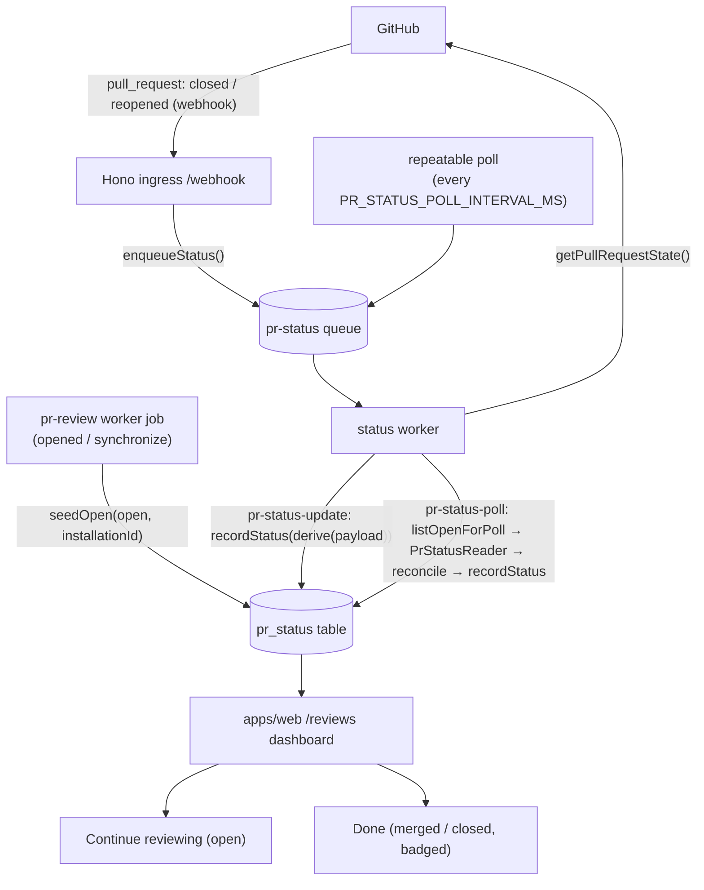
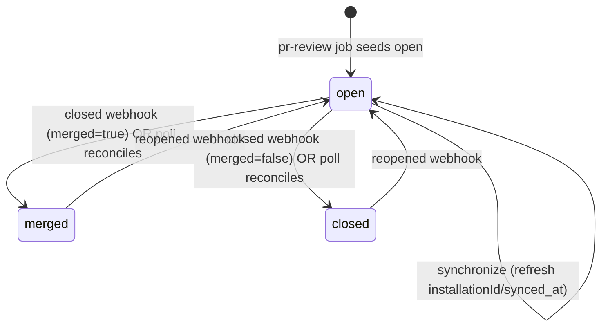

# feat: Background PR merge-status sync

## Summary

Keep review-session status in sync with GitHub in the background. When a PR is
**merged** or **closed**, diffsense detects it — by webhook when the app is up, by a
periodic background poll otherwise — persists the PR's lifecycle status, and the
hosted dashboard moves that session out of the active **"Continue reviewing"** list
into a badged **"Done"** view. The poll fallback also reconciles status that drifted
while the app was offline, and all background GitHub traffic respects rate limits.

This is a fully **deterministic** feature — no LLM, no agentic units. It extends the
deterministic shell (webhook ingress → queue → worker) with a new status concern,
keeping all I/O behind ports (`packages/core` stays vendor-free).

---

## Problem Frame

The dashboard's "Continue reviewing" list (issue #29) is a read-model over
`review_progress` ⋈ `decks`, filtered to sessions with `0 < reviewed < total`
(`apps/web/lib/reviewProgress.ts:250`). It has **no notion of the PR's lifecycle**:
once a PR is merged or closed on GitHub, the reviewer's half-finished session lingers
in the active list forever, inviting wasted attention on a change that can no longer
be acted on. Today the webhook ingress silently 204s the `closed` action
(`apps/app/src/ingress/server.ts:338`), nothing tracks merge/close state, and there is
no background poll — so even a merge that *did* fire a webhook is dropped on the floor.

We need to (a) capture PR lifecycle state in the background from two sources (webhook +
poll), (b) persist it per PR, (c) let the dashboard split active vs. done/archived, and
(d) stay correct after downtime and within GitHub's rate budget.

**Requirements traceability** (issue #31 acceptance criteria → R-IDs):

- **R1** — Merged/closed PR status is detected in the background (webhook + poll fallback).
- **R2** — Review session status updates automatically on merge/close.
- **R3** — Merged/closed PRs are badged and moved out of the active dashboard into a done/archived view.
- **R4** — Sync reconciles correctly after the app was offline during the merge.
- **R5** — Background work respects GitHub rate limits.

---

## Key Technical Decisions

**KTD1 — PR lifecycle status is persisted per PR, not per deck or per reviewer.**
Merge/close is a property of the PR, shared across every reviewer, head SHA, and deck.
A new `pr_status` table keyed `UNIQUE(owner, repo, pr_number)` holds a single derived
`status ∈ {open, merged, closed}`. The dashboard joins each reviewer's
`review_progress` groups against it. This mirrors how `review_progress`/`decks` already
relate (per-reviewer rows ⋈ per-PR/head decks) and avoids duplicating status across
heads.

**KTD2 — Two detection sources, one persisted truth.** The webhook path (fast, when the
app is up) and the poll path (fallback, catches missed events / offline windows) both
funnel into the same `PrStatusStore.recordStatus` upsert. The poll is what makes R4
hold: it reconciles `open` rows we still believe are open against live GitHub state, so
a merge that happened while the app was down is corrected on the next tick.

**KTD3 — Seed an `open` row whenever the worker processes a PR.** The poll needs a list
of PRs to reconcile and an installation id to authenticate with. The `pr-review` worker
job already carries `installationId` (`PrRef`), so after it builds the deck it seeds/refreshes
`pr_status(open, installationId)` — never clobbering a terminal `merged`/`closed`. Without
this seed there would be no `open` rows to poll and R4 could not hold.

**KTD4 — Background GitHub reads go through a dedicated `PrStatusReader` port, not the
review-unit `RepoReader`.** Lifecycle reconciliation is a background-sync concern, not a
review-context tool; keeping it on its own port preserves the "small components, one job"
rule and keeps `RepoReader` (the agentic review unit's toolset) clean. The adapter wraps
`octokit.rest.pulls.get` and reads `{ state, merged }`.

**KTD5 — Rate limits are respected by three compounding measures (R5):** (1) attach
`@octokit/plugin-throttling` + `@octokit/plugin-retry` to the GitHub App's Octokit so
all background calls auto-pace on primary *and* secondary limits; (2) the poll processes
a **bounded batch** per tick (`PR_STATUS_POLL_BATCH`, default 50), oldest-`synced_at`
first; (3) it groups rows by `installationId` to mint one token per installation per tick.

**KTD6 — The poll runs as a BullMQ repeatable job inside the existing `worker` role —
no new container/role.** Self-host constraint: a repeatable job (`repeat.every =
PR_STATUS_POLL_INTERVAL_MS`, default 5 min) is scheduled at worker startup. No
serverless, no cron container, no new compose service.

**KTD7 — Status derivation and reconciliation are pure functions in `core`.** GitHub's
`{ state, merged }` → `status` label, and `(current, live) → action` decisions, are pure
and unit-tested in `packages/core`; the worker/adapters only apply them. Keeps the
judgment deterministic and testable with no I/O, consistent with `resumeState`/`rankHunks`.

**KTD8 — A dedicated `pr-status` queue carries two job names** (`pr-status-update` from
the webhook, `pr-status-poll` repeatable). Keeping status jobs off the `review` queue
avoids mixing minutes-long review jobs with quick status upserts and lets each queue keep
its own retention policy. The status worker discriminates on `job.name`.

---

## High-Level Technical Design

### Detection → persistence → read-model (component view)



### Status lifecycle (state view)



`derivePrStatus({state, merged})` → `merged` if `state==="closed" && merged`; `closed`
if `state==="closed" && !merged`; else `open`. The dashboard classifies a session
**archived** when its PR's status is `merged` or `closed`, else **active**.

---

## Output Structure (new files)

```
packages/core/src/
  schemas/prStatus.ts            # PrLifecycle + PrStatusValue schemas
  status/prStatus.ts             # derivePrStatus, isArchivedStatus, reconcilePrStatus (pure)
  ports/prStatusReader.ts        # PrStatusReader port (live GitHub read)
  ports/prStatusStore.ts         # PrStatusStore port (persisted status)
apps/app/src/
  db/migrations/0011_pr_status.sql
  adapters/prStatusReader.ts     # Octokit adapter
  adapters/prStatusStore.ts      # Drizzle adapter
  worker/statusWorker.ts         # update + poll handlers
```

(plus modifications to `schema.ts`, `db.ts`, `server.ts`, `producer.ts`, `types.ts`,
`config.ts`, `main.ts`, `worker/index.ts`, `reviewProgress.ts`, `reviews/page.tsx`,
`package.json`, migration journal — see units.)

---

## Implementation Units

### U1. Core: PR status schemas, pure derivation/reconciliation, and ports

**Goal:** Define the vendor-free domain for PR lifecycle status: schemas, the pure
status derivation + reconciliation logic, and the two ports the adapters implement.

**Requirements:** R1, R2, R4 (derivation + reconciliation are the deterministic kernel).

**Dependencies:** none.

**Files:**
- `packages/core/src/schemas/prStatus.ts` (new) — `PrLifecycleSchema` (`{ state: "open" | "closed", merged: boolean }`, the live GitHub read shape) and `PrStatusValueSchema` (`z.enum(["open","merged","closed"])`); export inferred types.
- `packages/core/src/schemas/prStatus.test.ts` (new)
- `packages/core/src/status/prStatus.ts` (new) — pure `derivePrStatus(lifecycle): PrStatusValue`, `isArchivedStatus(s): boolean`, `reconcilePrStatus(current: PrStatusValue, live: PrLifecycle): { status: PrStatusValue; changed: boolean }`.
- `packages/core/src/status/prStatus.test.ts` (new)
- `packages/core/src/ports/prStatusReader.ts` (new) — `interface PrStatusReader { getPullRequestState(ref: GitHubPrRef): Promise<PrLifecycle | null> }` (reuse `GitHubPrRef` from `ports/githubGateway.ts`).
- `packages/core/src/ports/prStatusStore.ts` (new) — `interface PrStatusStore { recordStatus(rec): Promise<void>; seedOpen(ref): Promise<void>; markSynced(refs): Promise<void>; listOpenForPoll(limit): Promise<PrStatusPollRow[]> }` with row/record types.
- `packages/core/src/index.ts` (modify) — re-export all new symbols.

**Approach:** Pure functions only — no SDK, no I/O. `derivePrStatus` is total over the
two booleans/enums. `reconcilePrStatus` returns `changed:false` when the derived live
status equals `current`, so the poll can choose `markSynced` (cheap) vs `recordStatus`.
Ports declare interfaces only.

**Patterns to follow:** `packages/core/src/deck/reviewProgress.ts` (pure kernel +
schema), `packages/core/src/ports/deckStore.ts` (minimal port interface),
`packages/core/src/ports/githubGateway.ts` (`GitHubPrRef`).

**Test scenarios:**
- `derivePrStatus`: `{state:"open",merged:false}` → `open`; `{state:"closed",merged:true}` → `merged`; `{state:"closed",merged:false}` → `closed`; `{state:"open",merged:true}` (anomalous) → `open` (state wins). *Covers R1.*
- `isArchivedStatus`: `merged`/`closed` → true; `open` → false.
- `reconcilePrStatus`: current `open` + live merged → `{merged, changed:true}`; current `merged` + live merged → `{merged, changed:false}`; current `open` + live open → `{open, changed:false}`. *Covers R4 (offline drift detection).*
- Schema validation: rejects unknown `state`/`status` strings; accepts valid shapes.

---

### U2. DB: `pr_status` table, migration, web mirror, journal

**Goal:** Persist PR lifecycle status with a per-PR uniqueness guarantee and a DB-level
status domain, in lockstep across `apps/app` (canonical) and `apps/web` (read mirror).

**Requirements:** R2, R3 (storage the dashboard reads).

**Dependencies:** U1 (status value domain).

**Files:**
- `apps/app/src/db/schema.ts` (modify) — add `prStatus` pgTable: `id serial PK`, `owner/repo text`, `prNumber integer`, `status text NOT NULL`, `installationId integer NOT NULL`, `syncedAt timestamptz default now()`, `updatedAt timestamptz default now()`; `UNIQUE(owner, repo, pr_number)`; index on `(status, synced_at)` for the poll scan; CHECK `status IN ('open','merged','closed')`.
- `apps/app/src/db/migrations/0011_pr_status.sql` (new) — mirror the schema with `CREATE TABLE IF NOT EXISTS`, `--> statement-breakpoint`, `CREATE INDEX IF NOT EXISTS` (follow `0009_review_progress.sql` style).
- `apps/app/src/db/migrations/meta/_journal.json` (modify) — append `{ idx: 11, version: "7", when: 1782777600000, tag: "0011_pr_status", breakpoints: true }`.
- `apps/web/lib/db.ts` (modify) — mirror `prStatus` table (read path).
- `apps/app/src/db/db.test.ts` (modify) — integration coverage.

**Approach:** Status enum enforced at DB (precedent: `review_progress_decision_check`).
`installationId NOT NULL` because every write path (seed from `pr-review`, webhook
update) carries it. The `(status, synced_at)` index serves `listOpenForPoll`'s
`WHERE status='open' ORDER BY synced_at ASC LIMIT n`.

**Patterns to follow:** `decks`/`review_progress` table definitions in
`apps/app/src/db/schema.ts` and their `apps/web/lib/db.ts` mirrors; migration shape of
`0009_review_progress.sql`; journal entry format (monotonic `when`, +86_400_000 from `0010`).

**Test scenarios:**
- Insert a row, read it back; `UNIQUE(owner,repo,pr_number)` rejects a duplicate PR.
- CHECK rejects `status='bogus'`.
- Upsert-on-conflict updates `status`/`updated_at` for an existing PR.
- *Test expectation note:* DB integration tests require local Postgres (port 5433 per project memory); guard/skip if unavailable as existing db tests do.

---

### U3. Adapters: `PrStatusReader` (Octokit), `PrStatusStore` (Drizzle), rate-limit plugins

**Goal:** Implement both ports against real I/O and make the GitHub App's client
self-throttling/retrying.

**Requirements:** R1, R2, R4, R5.

**Dependencies:** U1 (ports), U2 (table).

**Files:**
- `apps/app/src/adapters/prStatusReader.ts` (new) — `createGitHubPrStatusReader(octokit)`; calls `octokit.rest.pulls.get({owner,repo,pull_number})`, returns `{ state, merged }`; maps 404 → `null` (reuse the `isNotFound` pattern from `repoReader.ts:63`).
- `apps/app/src/adapters/prStatusReader.test.ts` (new)
- `apps/app/src/adapters/prStatusStore.ts` (new) — `createDrizzlePrStatusStore(db)` implementing `recordStatus` (upsert sets status+updated_at+synced_at), `seedOpen` (insert `open`; on conflict refresh `installation_id`+`synced_at` but **do not** overwrite a terminal status), `markSynced` (bump `synced_at`), `listOpenForPoll(limit)` (status='open' order by synced_at asc limit).
- `apps/app/src/adapters/prStatusStore.test.ts` (new)
- `apps/app/src/adapters/githubApp.ts` (new, small) — `createGitHubApp(config)` building `new App({ appId, privateKey, Octokit: Octokit.plugin(throttling, retry) })` with `onRateLimit`/`onSecondaryRateLimit` callbacks that allow a bounded number of retries; reused by both workers.
- `apps/app/package.json` (modify) — add `@octokit/plugin-throttling` and `@octokit/plugin-retry` as explicit deps (present transitively today).

**Approach:** `seedOpen`'s conflict clause is the subtle bit — `... ON CONFLICT (owner,repo,pr_number) DO UPDATE SET installation_id = excluded.installation_id, synced_at = now() WHERE pr_status.status = 'open'` so a late `synchronize` cannot resurrect a merged PR. The throttling plugin's `onSecondaryRateLimit` returns `true` for the first N retries then gives up (logged), satisfying R5 without unbounded waiting.

**Patterns to follow:** `apps/app/src/adapters/deckStore.ts` (Drizzle upsert + `onConflictDoUpdate`), `apps/app/src/adapters/repoReader.ts` (minimal structural Octokit interface, 404 handling), worker `App` construction at `worker/index.ts:42`.

**Test scenarios:**
- `PrStatusReader`: maps `{state:"closed",merged:true}` through; 404 → `null`; non-404 error rethrows.
- `PrStatusStore.recordStatus`: inserts new; updates existing status + bumps `updated_at`.
- `PrStatusStore.seedOpen`: inserts `open`; on an existing `merged` row leaves status `merged` (refreshes `synced_at` only). *Covers R2 correctness under late events.*
- `PrStatusStore.listOpenForPoll`: returns only `open` rows, oldest `synced_at` first, capped at `limit`. *Covers R5.*

---

### U4. Webhook + queue + config: ingest `closed`/`reopened`, status queue & repeatable poll

**Goal:** Turn the dropped `closed` webhook into a status-update job, add the `pr-status`
queue with an update producer + a repeatable poll, and expose poll tuning via env.

**Requirements:** R1, R5, R6 (config plumbing).

**Dependencies:** U1 (types), U2/U3 (so the worker can consume — but producer/ingress
only enqueue).

**Files:**
- `apps/app/src/types.ts` (modify) — add `PR_STATUS_QUEUE_NAME`, `PR_STATUS_UPDATE_JOB`, `PR_STATUS_POLL_JOB`, and `PrStatusUpdateJob` (`{owner,repo,prNumber,installationId,deliveryId,state:"open"|"closed",merged:boolean}`).
- `apps/app/src/ingress/server.ts` (modify) — extend `PullRequestPayload` with `pull_request?: { merged?: boolean; state?: string }`; accept `action` ∈ {`opened`,`synchronize`} → existing `enqueue`; {`closed`,`reopened`} → new injected `enqueueStatus({...,state,merged})` (`reopened` ⇒ `state:"open",merged:false`). Other actions still 204. Add `enqueueStatus` to `createServer` options.
- `apps/app/src/ingress/server.test.ts` (modify)
- `apps/app/src/queue/producer.ts` (modify) — add `createStatusProducer(redisUrl)` with `enqueueStatusUpdate(job)` (jobId = deliveryId, retry/backoff like the review producer) and `scheduleStatusPoll({ everyMs })` (`queue.add(PR_STATUS_POLL_JOB, {}, { repeat: { every }, jobId: "pr-status-poll", removeOnComplete: true })`).
- `apps/app/src/config.ts` (modify) — add `prStatusPollIntervalMs` (coerce int, default 300_000) and `prStatusPollBatch` (coerce int, default 50).
- `apps/app/src/main.ts` (modify) — `serve` role: build `createStatusProducer`, pass `enqueueStatus` into `createServer`. (Worker wiring lands in U5.)

**Approach:** Webhook stays thin — it trusts the payload's `merged`/`state` (no extra
GitHub call) and enqueues fast. The repeatable job is upserted idempotently by stable
`jobId` so restarts don't multiply schedules.

**Patterns to follow:** `apps/app/src/queue/producer.ts` (`createProducer`),
existing webhook handler + tests in `server.ts:302`/`server.test.ts` (incl. the
`closed → 204` test that this unit changes to `closed → enqueueStatus`), `config.ts`
optional-with-default coercion (`port`).

**Test scenarios:**
- Signed `closed` (merged=true) webhook → `enqueueStatus` called with `state:"closed",merged:true`, 202; review `enqueue` not called.
- Signed `closed` (merged=false) → `enqueueStatus` with `merged:false`. *Covers R1.*
- Signed `reopened` → `enqueueStatus` with `state:"open",merged:false`.
- `opened`/`synchronize` → still route to review `enqueue` (regression guard).
- Unhandled action (e.g. `labeled`) → 204, neither producer called.
- `config`: defaults applied when env unset; overrides parsed.

---

### U5. Worker: status worker (update + poll) and `pr_status` seeding

**Goal:** Consume the `pr-status` queue and keep `pr_status` correct from both sources;
seed an `open` row whenever a PR is reviewed.

**Requirements:** R1, R2, R4, R5.

**Dependencies:** U1, U2, U3, U4.

**Files:**
- `apps/app/src/worker/statusWorker.ts` (new) — `startStatusWorker(config)`: `new Worker(PR_STATUS_QUEUE_NAME, handler)` discriminating on `job.name`:
  - `pr-status-update` → `recordStatus({ ...ref, status: derivePrStatus({state,merged}) })`.
  - `pr-status-poll` → `listOpenForPoll(config.prStatusPollBatch)`, group rows by `installationId`, one installation Octokit each, `PrStatusReader.getPullRequestState` per row, `reconcilePrStatus(current, live)`; `recordStatus` when `changed`, else `markSynced`; `null` live (404) → `markSynced` (skip, don't hammer). Errors per-row are logged, not fatal.
- `apps/app/src/worker/statusWorker.test.ts` (new)
- `apps/app/src/worker/index.ts` (modify) — use `createGitHubApp` (U3, with plugins); wire `prStatusStore`; after `handlePullRequestEvent`, `await prStatusStore.seedOpen({owner,repo,prNumber,installationId})` (best-effort, logged on failure so it never sinks the ranked comment).
- `apps/app/src/main.ts` (modify) — `worker` role: also `startStatusWorker(config)` and `scheduleStatusPoll({ everyMs: config.prStatusPollIntervalMs })`; drain both on shutdown.

**Approach:** The poll loop is the R4 engine — it walks `open` rows oldest-first,
asks GitHub, and reconciles. Bounded batch + grouped tokens + the throttling plugin
keep it within budget (R5). Seeding (`seedOpen`) is the only change to the hot
`pr-review` path and is strictly additive/best-effort.

**Patterns to follow:** `apps/app/src/worker/index.ts` composition root (Redis, App,
DB pool, per-job installation Octokit, `worker.on("failed"/"error")`); best-effort
side-effect pattern (deck persist is already best-effort there).

**Test scenarios:**
- `pr-status-update` handler: job `{state:"closed",merged:true}` → `recordStatus` with `merged`. *Covers R2.*
- `pr-status-poll` handler with a fake reader: an `open` row whose live state is merged → `recordStatus(merged)` (R4 offline reconcile); an `open` row still open → `markSynced` only; 404 → `markSynced`.
- Poll groups two PRs under one installation → one `getInstallationOctokit` call. *Covers R5 token reuse.*
- Poll respects `prStatusPollBatch` (only N rows fetched).
- A row that throws mid-poll doesn't abort the rest (logged, continues).
- `seedOpen` invoked after a successful `pr-review` job.

---

### U6. Web dashboard: split active vs. done, badge merged/closed

**Goal:** Make `/reviews` read `pr_status` and present two sections — active
"Continue reviewing" (open PRs) and "Done" (merged/closed, badged) — so finished PRs
leave the active list.

**Requirements:** R2, R3.

**Dependencies:** U2 (web mirror), U1 (`isArchivedStatus`).

**Files:**
- `apps/web/lib/reviewProgress.ts` (modify) — load `pr_status` for the reviewer's distinct PRs; replace/extend `summarizeInProgress` with `summarizeSessions(progressRows, deckRows, statusRows): { active: InProgressReview[]; archived: ArchivedReview[] }`. Active = PR not archived **and** `0 < reviewed < total` (existing rule). Archived = PR `merged`/`closed` **and** `reviewed > 0` (show regardless of completeness), carrying `status` for the badge. Add `listReviewSessions(githubUserId)`.
- `apps/web/lib/reviewProgress.test.ts` (modify)
- `apps/web/app/reviews/page.tsx` (modify) — call `listReviewSessions`; render the existing list for `active`, plus a "Done" section for `archived` with a `Merged`/`Closed` badge (reuse `badge` from `lib/ui`). Archived rows are not resume links (the deck is read-only / informational).

**Approach:** Reuse the established read-model shape; the only new input is the
`pr_status` map keyed by `prKey(owner,repo,prNumber)`. `summarizeSessions` stays pure
(map in, buckets out) so it is unit-testable exactly like `summarizeInProgress` today.

**Patterns to follow:** `summarizeInProgress`/`listInProgress` in
`apps/web/lib/reviewProgress.ts:169,276`; the `stale` badge + `ReviewRow` rendering in
`apps/web/app/reviews/page.tsx`; the `web_sessions`/`review_progress` read-mirror pattern.

**Test scenarios:**
- A reviewer with progress on an `open` PR (`0<reviewed<total`) → in `active`, not `archived`. *Covers R3.*
- Same reviewer, PR now `merged` → in `archived` with `status:"merged"`, removed from `active` — *even if the deck was complete or only partially reviewed.* *Covers R2, R3.*
- PR `closed` (not merged) → `archived` with `status:"closed"`.
- No `pr_status` row for a PR → treated as `open` (active rule unchanged) — backward-compatible with PRs reviewed before this feature.
- Page renders a `Merged`/`Closed` badge on archived rows and the empty state when both buckets are empty.

---

## Scope Boundaries

**In scope:** webhook handling of `closed`/`reopened`; persisted per-PR status; the
background poll fallback with rate-limit controls; dashboard active/done split with
badges; reconciliation after downtime.

**Out of scope (not this issue):**
- Merge-gating or any enforcement — diffsense stays advisory (STRATEGY.md "Not working on").
- Manager dashboards / cross-reviewer aggregation.
- Notifying reviewers (email/Slack) when their PR merges.
- Backfilling status for PRs reviewed before this migration (they default to `open`/active and self-correct on the next poll or webhook).

**Deferred to Follow-Up Work:**
- A separate `/reviews/archived` route or pagination if the Done list grows large (a single page section suffices for the validation pilot).
- Webhook `pull_request.reopened`-driven re-review (we only restore status, not re-rank).
- Per-installation rate-limit prioritization beyond the bounded batch + throttling plugin.

---

## Risks & Mitigations

- **Missed/duplicate webhooks** → poll reconciles (R4); update job is an idempotent upsert keyed by PR, and `jobId = deliveryId` collapses duplicate deliveries.
- **Secondary rate limits under a burst of open PRs** → throttling plugin + bounded batch + oldest-first ordering spread load; batch/interval are env-tunable.
- **Migration drift on long-lived local Postgres** (see project memory) → `0011` uses `IF NOT EXISTS`; if a constraint appears pre-existing, treat as drift, not regression.
- **`seedOpen` clobbering a terminal status via a late event** → conflict clause refreshes only when current status is `open`.
- **`apps/app` ↔ `apps/web` schema mirror drift** → both table defs land in the same unit (U2); a mismatch surfaces in `reviewProgress.test.ts`.

---

## Verification

- `pnpm -r build`, `pnpm -r test`, `pnpm -r lint` (Biome) all green.
- New core logic covered by pure unit tests (no I/O); adapters and dashboard covered per-unit.
- DB integration tests pass against local Postgres (port 5433); skipped cleanly when unavailable.
- Manual trace (documented, not required to run): merge a PR → webhook `closed` → status `merged` → dashboard moves session to "Done" with a Merged badge; with the app stopped during merge, the next poll tick reconciles it.

---

## Non-Negotiable Rules Compliance

- **`packages/core` imports no vendor SDK** — U1 is pure schemas/functions/port interfaces; all Octokit/Drizzle/BullMQ code is in `apps/app` adapters.
- **LLM provider-agnostic / self-host** — feature uses no LLM; poll is a BullMQ repeatable job in the existing `worker` role (no serverless, no new infra).
- **Deterministic pipeline; agentic only in the review unit** — status derivation, reconciliation, selection, and delivery are all deterministic pure functions + a fixed worker sequence; no agent loop is introduced.
