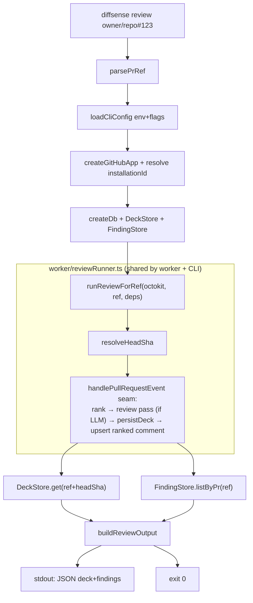

# feat: CLI + Claude skill for agent-driven review

## Summary

Add a `diffsense review <pr-ref>` CLI command and a Claude skill that wraps it, so an
agent can run a full diffsense review on a PR — outside the web UI — and act on the
result. The CLI runs the **same on-demand pipeline** the web `/decks` trigger runs (rank
→ optional agentic review → build+persist the ordered Deck → upsert the advisory ranked
comment) by reusing the existing `handlePullRequestEvent` seam and the Drizzle stores. It
emits the ordered deck and findings as machine-readable JSON on stdout and returns
meaningful exit codes. No new review logic is written — the only refactor extracts the
worker's per-PR orchestration into a shared runner that both the worker and the CLI call.

This is the agent-native surface (docs/ARCHITECTURE.md §6): any action the reviewer takes
in the UI, an agent can take through the CLI, over the same stores.

---

## Problem Frame

The hosted card view (#13) and the web on-demand trigger (#26) let a human reviewer
process a PR into an ordered Deck and read risk-ranked cards. There is no agent-facing
surface: an LLM agent (e.g. Claude) cannot run a diffsense review or read its structured
output without a browser. Issue #32 closes that gap with a scriptable CLI plus a Claude
skill that documents how to invoke it and interpret the JSON.

The non-negotiables (CLAUDE.md, docs/ARCHITECTURE.md, docs/STACK.md) constrain the shape:
- `packages/core` stays pure — no vendor SDK, no new I/O. All CLI code lives in `apps/app`
  (the composition shell) and `.claude/skills`.
- LLM access only through the `LLMProvider` port via `@diffsense/llm` (`createReviewProvider`),
  never a vendor SDK directly. Provider/model come from env.
- The pipeline stays deterministic; only the per-chunk review unit is agentic. The CLI
  reuses the existing deterministic seam — it adds no new judgment.
- Self-host only: the CLI runs in-process against the same Postgres; no serverless, no new
  managed-service assumption. It does **not** require Redis (it bypasses the queue and calls
  the seam directly), so it must not depend on the queue-only config.

---

## Requirements

Traceability to issue #32 acceptance criteria (AC1–AC5):

- **AC1** — `diffsense review <pr-ref>` runs the pipeline and outputs the ordered deck/findings.
- **AC2** — Output is structured and machine-readable (JSON) with meaningful exit codes.
- **AC3** — Auth/config come from env or flags; provider-agnostic + self-host rules respected.
- **AC4** — A Claude skill wraps the CLI with description + usage so an agent can review via the CLI.
- **AC5** — CLI reuses the engine and stores — no duplicate review logic.

Out of scope (not in #32's acceptance boxes; do not pull in):
- Posting a *card-level* comment from the CLI (the web `GitHubGateway.postComment` path).
  The CLI's review run still upserts the **deterministic ranked comment**, exactly as the
  pipeline does today — that is part of "the same on-demand pipeline," not new behavior.
  Card-level commenting is deferred (see Scope Boundaries).
- A no-comment / dry-run mode (would require threading an option through the shared seam).
- Any change to ranking, chunk selection, deck building, or cost control.

---

## Key Technical Decisions

**KTD1 — Reuse via an extracted shared runner, not an HTTP client.** The CLI runs the
pipeline **in-process** by calling the same `handlePullRequestEvent` seam + `processPrIntoDeck`
the worker calls, then reads the deck back from `DeckStore`. It does **not** poke a running
`serve` instance over HTTP. Rationale: the issue says the CLI "runs the same on-demand
pipeline" (AC1) and "reuses the engine and stores" (AC5) — in-process reuse is the truest
reading, needs no running server or Redis, and keeps the self-host story to "one Postgres."
To guarantee "no duplicate review logic" (AC5), the worker's currently-inline per-PR
orchestration (`resolveHeadSha`, `buildReviewSupport`, `makeDeckPersister`, source
collection) is **extracted** into a shared module that both `startWorker` and the CLI import.

**KTD2 — GitHub App auth, reusing the engine's existing path.** The CLI authenticates with
the same GitHub App credentials the worker uses (`GITHUB_APP_ID`, `GITHUB_PRIVATE_KEY` via
`createGitHubApp`). It resolves the installation id from the repo with
`app.octokit.rest.apps.getRepoInstallation({owner, repo})`, with a `--installation-id` flag /
`GITHUB_INSTALLATION_ID` env override to skip the lookup. No new auth mode (no PAT path) —
this keeps parity with the worker and avoids a second GitHub adapter. Satisfies AC3
("auth/config from env or flags").

**KTD3 — A focused CLI config loader, not the full `loadConfig`.** `loadConfig()` requires
`REDIS_URL` and `GITHUB_WEBHOOK_SECRET`, which the CLI does not use. A new narrow loader
requires only `GITHUB_APP_ID`, `GITHUB_PRIVATE_KEY`, `DATABASE_URL`, and reads optional
`PUBLIC_BASE_URL` / `WEB_BASE_URL` / `GITHUB_INSTALLATION_ID`. The shared runner takes a
`Pick<>` of config fields so both the full `Config` (worker) and the narrow CLI config
satisfy it. Keeps the CLI runnable without a queue (self-host honesty).

**KTD4 — JSON to stdout, diagnostics to stderr, exit codes by failure class.** The command
prints one JSON object to **stdout** (the only thing on stdout, so it pipes cleanly to
`jq`); all human/progress/error text goes to **stderr**. Exit codes: `0` success; `2` usage
error (bad args / unparseable `<pr-ref>`); `3` config/auth error (missing creds, GitHub auth
failure); `4` PR/repo not found or access denied (GitHub 404/403); `1` any other runtime
error. The pure mapping from error → code is unit-tested without spawning a process.

**KTD5 — LLM is optional, same as the worker.** When a provider key
(`ANTHROPIC_API_KEY` | `OPENAI_API_KEY` | `GOOGLE_GENERATIVE_AI_API_KEY`) is present, the
agentic review pass runs and findings are persisted + emitted; with no key, the CLI still
ranks, builds the deck, and emits it (deck explanations are the structural defaults). The
output's `llm` boolean tells the agent which mode ran. Provider/model resolve via
`@diffsense/llm` from env — provider-agnostic.

**KTD6 — Output shape mirrors the stores, not a new schema.** The JSON embeds the existing
`Deck` (cards carry `riskScore`, `highlights`, `suggestions`, `explanation` — the "risk
scores, highlighted ranges, suggestions, plain-language explanations" the issue names) and
the `ReviewFinding[]` from `FindingStore.listByPr`. No new public data schema is invented;
the CLI is a thin transport over the read-model.

---

## High-Level Technical Design



The deterministic seam is unchanged. The only structural move is lifting the per-PR wiring
out of `startWorker`'s closure into `reviewRunner.ts` so the CLI shares it verbatim.

---

## Output Structure

```
apps/app/src/
  cli/
    main.ts          # entry: argv dispatch ("review" subcommand), wires real deps, sets exit code
    review.ts        # runReviewCommand(args, deps, io) -> exit code  (testable, deps injected)
    review.test.ts
    prRef.ts         # parsePrRef(input) -> {owner, repo, prNumber}  (pure)
    prRef.test.ts
    config.ts        # loadCliConfig(env) -> CliConfig  (narrow; no Redis/webhook secret)
    config.test.ts
    output.ts        # buildReviewOutput(...) + exitCodeForError(err)  (pure)
    output.test.ts
  worker/
    reviewRunner.ts      # NEW: extracted shared runner (runReviewForRef + wiring helpers)
    reviewRunner.test.ts # NEW
    index.ts             # MODIFIED: startWorker imports the shared runner
bin/
  diffsense          # repo-root shell wrapper -> tsx apps/app/src/cli/main.ts
.claude/skills/
  diffsense-review/
    SKILL.md         # NEW skill: description + usage + JSON shape + exit codes
```

---

## Implementation Units

### U1. Extract the shared review runner from the worker

**Goal:** Move the worker's inline per-PR orchestration into a reusable module so both the
worker and the CLI run the identical pipeline (AC5). Behavior-preserving refactor.

**Requirements:** AC5.

**Dependencies:** none.

**Files:**
- `apps/app/src/worker/reviewRunner.ts` (new) — export `runReviewForRef(octokit, ref, deps)`,
  `buildReviewSupport(config, db)`, `type ReviewSupport`, `type ReviewRunnerDeps`. Move
  `resolveHeadSha`, `makeDeckPersister`, `collectSources`, `changedSourcePaths`, `hasLlmKey`,
  and the `SOURCE_EXT`/`MAX_SOURCE_FILES` constants here from `worker/index.ts`.
- `apps/app/src/worker/index.ts` (modify) — delete the moved helpers; in the job callback
  call `await runReviewForRef(octokit, ref, { deckStore, reviewSupport, reactionBaseUrl,
  cardViewBaseUrl })`, then keep the existing `seedPrStatus(prStatusStore, ref)` call
  (status seeding stays a worker-only concern, not part of the shared runner).
- `apps/app/src/worker/reviewRunner.test.ts` (new).

**Approach:** `runReviewForRef` resolves the head SHA, then calls `handlePullRequestEvent`
with `reviewFindings` (from `reviewSupport?.makeRunner(...)`) and `persistDeck` (from
`makeDeckPersister(deckStore, ref, headSha)`), returning `{ headSha, upsert }`. `ReviewSupport`
and `buildReviewSupport` move unchanged (they already read the LLM key from `process.env` and
share the worker's `db`). The runner's `config` parameter is narrowed to
`Pick<Config, "publicBaseUrl" | "webBaseUrl">`-style fields it actually reads, so the CLI's
config also satisfies it. Keep `seedPrStatus` and `resolveHeadSha`'s best-effort,
log-don't-throw posture intact.

**Patterns to follow:** the existing `worker/index.ts` structure (this is a lift, not a
rewrite); best-effort try/catch + console logging already there.

**Test scenarios:**
- `runReviewForRef` calls `handlePullRequestEvent` once with both `reviewFindings` and
  `persistDeck` wired, and returns the seam's `upsert` plus the resolved `headSha`. (fake octokit + spies)
- When the head SHA cannot be resolved (octokit `pulls.get` throws), it still calls the seam,
  the deck persister no-ops with a warning, and the ranked comment upsert still happens
  (returns `headSha: undefined`). Covers the degrade path.
- With `reviewSupport: null` (no LLM), the seam is called with `reviewFindings` undefined and
  the deck still persists. Happy path, no-LLM mode.
- Integration-ish: `buildReviewSupport` returns `null` when no provider key is in env and a
  non-null runner when a key is present (toggle a fake env).

### U2. Parse `<pr-ref>` into PR coordinates

**Goal:** Pure parser accepting the forms an agent will paste.

**Requirements:** AC1, AC2 (usage errors → exit 2).

**Dependencies:** none.

**Files:** `apps/app/src/cli/prRef.ts`, `apps/app/src/cli/prRef.test.ts`.

**Approach:** `parsePrRef(input: string): { owner; repo; prNumber }` — accept
`owner/repo#123`, `owner/repo/123`, and full URLs `https://github.com/owner/repo/pull/123`
(and `/pull/123/files` etc.). Reject anything else with a typed error carrying a clear
message. Pure, no I/O.

**Test scenarios:**
- `owner/repo#123` → `{owner:"owner", repo:"repo", prNumber:123}`.
- `owner/repo/123` → same.
- `https://github.com/o/r/pull/45` and `.../pull/45/files` → `{o,r,45}`.
- Invalid: `owner/repo`, `owner#1`, `repo#1`, `owner/repo#abc`, empty string → throws the
  typed usage error.
- Owner/repo with hyphens and dots (`my-org/my.repo#7`) parse correctly.

### U3. Narrow CLI config loader

**Goal:** Load only the env the CLI needs, with flag overrides — no Redis/webhook coupling (AC3, KTD3).

**Requirements:** AC3.

**Dependencies:** none.

**Files:** `apps/app/src/cli/config.ts`, `apps/app/src/cli/config.test.ts`.

**Approach:** `loadCliConfig(env, overrides?)` → Zod-validated `CliConfig`:
required `githubAppId`, `githubPrivateKey`, `databaseUrl`; optional `publicBaseUrl`,
`webBaseUrl`, `installationId` (number). Flag overrides (`--installation-id`) take precedence
over env. On a validation miss, throw an error whose message lists the missing/invalid keys
(mirror `config.ts`'s issue-formatting), so the CLI can map it to exit code 3.

**Test scenarios:**
- All required env present → parses; optional fields default to undefined.
- Missing `GITHUB_APP_ID` / `DATABASE_URL` → throws with the offending key named.
- `--installation-id 42` override beats `GITHUB_INSTALLATION_ID=99`.
- Invalid `DATABASE_URL` (not a URL) → throws.
- `Test expectation`: pure validation only — no DB/network.

### U4. Build the JSON output and classify exit codes

**Goal:** Pure functions turning a finished run into the stdout payload and mapping errors to
exit codes (AC2, KTD4, KTD6).

**Requirements:** AC2.

**Dependencies:** U2 (error types).

**Files:** `apps/app/src/cli/output.ts`, `apps/app/src/cli/output.test.ts`.

**Approach:**
- `buildReviewOutput({ pr, headSha, upsert, deck, findings, llm })` → a plain object:
  `{ pr:{owner,repo,prNumber}, headSha, comment:{action,commentId}, deck, findings, llm }`.
  `deck` is the `Deck | null` (null when head unresolved or store empty); `findings` the
  `ReviewFinding[]`. No reshaping of store types — embed as-is so the schema stays single-sourced.
- `exitCodeForError(err)` → `2 | 3 | 4 | 1` based on error class (usage error from U2 → 2;
  config error from U3 → 3; a GitHub 404/403 signal → 4; else 1). Use small tagged error
  classes (e.g. `UsageError`, `CliConfigError`) so the mapping is exact, plus a heuristic on
  Octokit `RequestError.status` for 404/403.

**Test scenarios:**
- `buildReviewOutput` with a deck + 2 findings + `llm:true` → exact object shape; cards
  preserved in rank order.
- With `deck:null` and `findings:[]` (no-LLM, head unresolved) → `deck:null`, `findings:[]`,
  `llm:false`.
- `exitCodeForError`: `UsageError`→2, `CliConfigError`→3, Octokit-style `{status:404}`→4,
  `{status:403}`→4, generic `Error`→1.
- Output JSON round-trips through `JSON.parse(JSON.stringify(...))` unchanged (no functions/undefined-only keys).

### U5. The `review` command (orchestration, injected deps)

**Goal:** Wire parse → config → auth → stores → shared runner → read deck/findings → emit JSON,
with deps injected so it is unit-testable without a real DB or GitHub (AC1, AC5).

**Requirements:** AC1, AC2, AC5.

**Dependencies:** U1, U2, U3, U4.

**Files:** `apps/app/src/cli/review.ts`, `apps/app/src/cli/review.test.ts`.

**Approach:** `runReviewCommand(argv, deps, io): Promise<number>` where `deps` provides the
factories (`makeApp`, `makeDb`, `makeDeckStore`, `makeFindingStore`, `buildReviewSupport`,
`runReviewForRef`) and `io` provides `{ stdout, stderr }` writers. Real wiring lives in `main.ts`;
tests pass fakes. Flow: parse pr-ref (U2) → load config (U3) → build app, resolve installation id
(flag/env or `getRepoInstallation`) → build octokit → db + stores + review support → assemble
`PrRef { owner, repo, prNumber, installationId, action:"synchronize", deliveryId:"cli-"+uuid }`
→ `runReviewForRef` → `deck = headSha ? deckStore.get({...,headSha}) : null` →
`findings = findingStore.listByPr({owner,repo,prNumber})` → `io.stdout(JSON.stringify(buildReviewOutput(...)))`
→ return 0. Catch errors, write a one-line message to `io.stderr`, return `exitCodeForError(err)`.

**Patterns to follow:** the worker's composition order in `startWorker`; optional-DI testing
style with `vi.fn()` from `ingress/server.test.ts`.

**Test scenarios:**
- Happy path: fakes return a 2-card deck + 1 finding; `runReviewCommand` writes exactly one
  JSON object to stdout matching `buildReviewOutput`, nothing to stdout besides it, returns 0.
- LLM-off: `buildReviewSupport` fake returns null → output `llm:false`, deck still emitted, returns 0.
- Bad pr-ref → writes usage message to stderr, returns 2, makes no GitHub/db calls.
- Installation id from `--installation-id` flag skips `getRepoInstallation`.
- GitHub auth/lookup throws `{status:404}` → stderr message, returns 4.
- Config error (missing creds) → returns 3.
- `Covers AC2.` stdout carries only the JSON object; diagnostics go to stderr.

### U6. CLI entry, scripts, and bin wrapper

**Goal:** A runnable `diffsense review <pr-ref>` entry that wires real adapters and exits with
the returned code.

**Requirements:** AC1, AC3.

**Dependencies:** U5.

**Files:**
- `apps/app/src/cli/main.ts` (new) — `#!/usr/bin/env` not needed (run via tsx). Read
  `process.argv.slice(2)`; if first token !== `review`, print usage to stderr + exit 2;
  build real `deps`/`io`, `process.exit(await runReviewCommand(rest, realDeps, realIo))`.
- `apps/app/package.json` (modify) — add script `"cli": "tsx src/cli/main.ts"`.
- root `package.json` (modify) — add `"diffsense": "pnpm -C apps/app cli"`.
- `bin/diffsense` (new) — shell wrapper: `exec pnpm --dir "$ROOT/apps/app" exec tsx src/cli/main.ts "$@"`.

**Approach:** Thin glue only; no logic beyond argv dispatch and `process.exit`. Real `deps`
bind `createGitHubApp`, `createDb`, the Drizzle store factories, `buildReviewSupport`, and
`runReviewForRef`.

**Test scenarios:** `Test expectation: none` — pure wiring/`process.exit` glue; all logic is
covered in U2–U5. (Manual smoke verification noted under Verification.)

### U7. Claude skill wrapping the CLI

**Goal:** Ship `.claude/skills/diffsense-review/SKILL.md` so an agent discovers and uses the
CLI correctly (AC4).

**Requirements:** AC4.

**Dependencies:** U6.

**Files:** `.claude/skills/diffsense-review/SKILL.md` (new).

**Approach:** Follow the frontmatter shape of `.claude/skills/diffsense-e2e/SKILL.md`
(`name`, `description` as a folded scalar with trigger phrases). Document: one-line purpose;
the canonical command (`pnpm -C apps/app cli review <pr-ref>` and the `bin/diffsense review`
form); required env (`GITHUB_APP_ID`, `GITHUB_PRIVATE_KEY`, `DATABASE_URL`) and optional env
(LLM provider key + `REVIEW_MODEL`, `GITHUB_INSTALLATION_ID`, `PUBLIC_BASE_URL`, `WEB_BASE_URL`);
the JSON output shape (annotated `pr`/`headSha`/`comment`/`deck.cards[]`/`findings[]`/`llm`);
the exit-code table (0/1/2/3/4); and a worked example of an agent piping to `jq` to read the
top-ranked card and act on it. State the self-host + provider-agnostic facts (no key → deck
still emitted; provider chosen by env).

**Test scenarios:** `Test expectation: none -- documentation`. Validate by review against the
existing skill's structure and by confirming every documented flag/env/exit-code matches the
implementation.

---

## Scope Boundaries

### Deferred to Follow-Up Work
- **Card-level comment posting from the CLI** (`diffsense comment <pr-ref> --card <fp>` reusing
  the core `GitHubGateway.postComment` + `cardCommentAnchor`). The review run already upserts
  the deterministic ranked comment; agent-driven *card* comments are an additive surface not in
  #32's acceptance boxes. A follow-up can add it by sharing the web adapter's `postComment`.
- **`--no-comment` / dry-run mode** — would require an option through `handlePullRequestEvent`.
- **A `--format text` human-readable renderer** — JSON satisfies AC2; pretty output is cosmetic.

### Out of scope (other issues / product identity)
- Ranking, chunk selection, deck building, cost control changes — owned elsewhere and must stay
  deterministic.
- A GitHub PAT auth mode — the App path matches the engine; adding a second adapter is unjustified now.

---

## Risks & Dependencies

- **Refactor regression (U1).** Extracting the runner could change worker behavior. Mitigation:
  it is a mechanical lift (helpers move unchanged); `worker/index.ts` has no direct test, but
  `handlePullRequestEvent.test.ts` and `processPrIntoDeck.test.ts` cover the seam the runner
  calls, and the new `reviewRunner.test.ts` covers the runner. Keep the best-effort/log posture identical.
- **Stdout cleanliness (KTD4).** Any stray `console.log` from adapters could corrupt the JSON on
  stdout. Mitigation: the command writes JSON via `io.stdout`; adapters already log via
  `console.error`/`console.warn` (stderr). Test asserts stdout carries only the JSON object.
- **Installation-id resolution (KTD2).** `getRepoInstallation` 404s if the App isn't installed on
  the repo → mapped to exit 4 with a clear message; the `--installation-id` override bypasses it.
- **CI is gitignored (`.github/workflows/ci.yml`).** It does not run on GitHub (see memory). Verify
  locally: `pnpm lint`, `pnpm typecheck`, `pnpm test`. New tests use fakes (no Postgres needed).

---

## Verification

- `pnpm lint && pnpm typecheck && pnpm test` all green; new unit suites (U1–U5) pass.
- Manual smoke (self-host stack up, App installed): `pnpm -C apps/app cli review <owner/repo#n>`
  prints a JSON object with a non-empty `deck.cards` array ordered by rank, exits 0; the PR shows
  the upserted ranked comment. With no LLM key set, output `llm:false` and the deck still emits.
  A bogus ref exits 2; missing creds exit 3; an un-installed repo exits 4.
- The skill file parses (valid frontmatter) and its documented commands/flags/exit codes match U6/U4.
